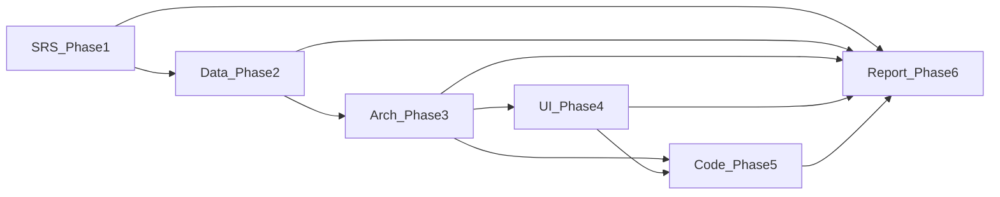
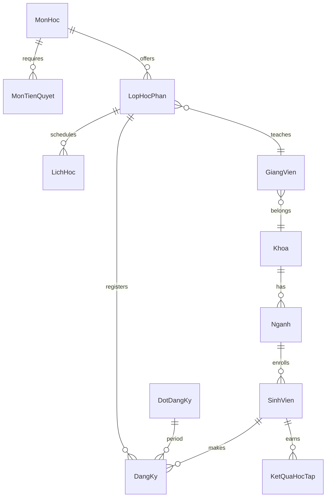
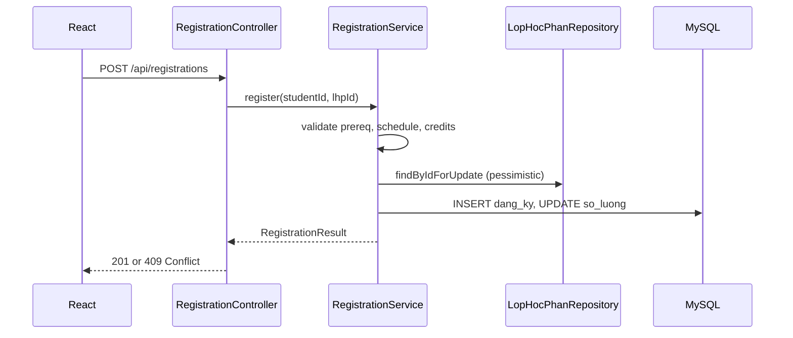

# Kế hoạch đồ án: Hệ thống Quản lý Đăng ký Học theo Tín chỉ

## Bối cảnh hiện tại

- Repo [PTTKPM25-26_ClassN05_Nhom-21](https://github.com/datwhite21/PTTKPM25-26_ClassN05_Nhom-21) **chưa có mã nguồn** — chỉ có Git.
- Stack đã chốt: **Spring Boot 3 + JPA/Hibernate + MySQL 8**, **React (Vite) + TypeScript**, kiến trúc **Monolith phân lớp** (Controller → Service → Repository).
- Deliverable: **repo đầy đủ** theo cấu trúc thư mục nhóm: `Documents/`, `Design/`, `SRC/`, `README.md`, `CHANGELOG.md`.



---

## Cấu trúc repo đích (theo yêu cầu nhóm)

```
PTTKPM25-26_ClassN05_Nhom-21/
├── README.md                   # Thông tin dự án: mô tả, stack, hướng dẫn chạy, thành viên
├── CHANGELOG.md                # Lịch sử thay đổi theo chuẩn Keep a Changelog
│
├── Documents/                  # Kế hoạch, SRS, báo cáo (Markdown/Word export)
│   ├── 00-Ke-Hoach-Tong.md     # Kế hoạch 6 phase + lộ trình tuần
│   ├── 01-SRS.md               # Phase 1 — Đặc tả yêu cầu
│   ├── 06-Bao-Cao/
│   │   ├── 06-Report-Outline.md
│   │   └── (các chương nháp / file Word xuất sau)
│   └── weekly-reports/         # Báo cáo tiến độ hàng tuần
│       ├── Week-01.md
│       ├── Week-02.md
│       └── README.md           # Mẫu & quy ước đặt tên báo cáo tuần
│
├── Design/                     # Tài liệu thiết kế + sketch (ảnh)
│   ├── 02-BPM-DFD.md           # Phase 2 — BPM, DFD (Mermaid)
│   ├── 03-CDM-PDM.md           # Phase 2 — ER, 3NF
│   ├── 04-Architecture.md      # Phase 3 — Kiến trúc, patterns, API
│   ├── 05-UI-UX-Wireframes.md  # Phase 4 — Wireframe mô tả
│   └── sketches/               # Ảnh wireframe, Use Case diagram, ER export PNG
│       ├── use-case-diagram.png
│       ├── er-diagram.png
│       └── ui-*.png
│
└── SRC/                        # Toàn bộ mã nguồn & database
    ├── backend/                # Spring Boot 3 + JPA
    │   └── src/main/java/.../registration/
    │       ├── controller/
    │       ├── service/
    │       ├── repository/
    │       ├── entity/
    │       ├── dto/
    │       └── exception/
    ├── frontend/               # React (Vite) + TypeScript
    │   └── src/
    │       ├── pages/
    │       ├── components/
    │       └── api/
    └── database/
        ├── schema/V1__init.sql
        └── seeds/sample_data.sql
```

### Vai trò từng thư mục / file gốc

| Thành phần | Mục đích | Gắn với Phase |
|------------|----------|---------------|
| **Documents/** | Kế hoạch tổng, SRS, khung & nháp báo cáo đồ án, **báo cáo hàng tuần** cho GVHD | 1, 6 + liên tục mỗi tuần |
| **Design/** | BPM, DFD, CDM/PDM, kiến trúc, UI/UX; **sketches/** chứa ảnh diagram & wireframe | 2, 3, 4 |
| **SRC/** | Code backend, frontend, SQL migrations/seeds | 5 |
| **README.md** | Note dự án: tên đề tài, nhóm, cách clone, env, lệnh `mvn`/`npm`, link Documents & Design | Ngay từ đầu, cập nhật khi Phase 5 |
| **CHANGELOG.md** | Ghi `[Unreleased]`, `[x.y.z] - yyyy-mm-dd`: Added/Changed/Fixed theo từng sprint/tuần | Sau mỗi milestone |

### Quy ước báo cáo tuần (`Documents/weekly-reports/Week-NN.md`)

Mỗi file tuần gồm: **Công việc đã làm** | **Kết quả / deliverable** | **Khó khăn** | **Kế hoạch tuần sau** | (tuỳ chọn) link commit/PR.

### Quy ước CHANGELOG

- Cập nhật khi merge feature lớn (SRS xong, schema xong, API đăng ký xong…).
- Ví dụ mục: `Added: RegistrationService with pessimistic locking (SRC/backend)`.

---

## Phase 1 — SRS (Phân tích yêu cầu)

**Mục tiêu:** Định hình Actor, phạm vi, FR/NFR, danh sách Use Case và đặc tả chi tiết 2 UC cốt lõi.

**File deliverable:** [Documents/01-SRS.md](Documents/01-SRS.md) (kèm [Documents/00-Ke-Hoach-Tong.md](Documents/00-Ke-Hoach-Tong.md))

**Nội dung bắt buộc (Markdown, bảng rõ ràng):**

| Mục | Nội dung chính |
|-----|----------------|
| Giới thiệu | Bối cảnh, mục tiêu, phạm vi in/out |
| Actor | Sinh viên, Giảng viên, Giáo vụ (Admin); có thể thêm Hệ thống (timer đóng cổng) |
| FR — Sinh viên | Đăng ký/hủy môn, xem lịch, xem điểm, giỏ tạm, xem điều kiện tín chỉ |
| FR — Giảng viên | Nhập/sửa điểm, xem lịch dạy, danh sách lớp phụ trách |
| FR — Giáo vụ | CRUD lớp HP, mở/đóng cổng đăng ký, tiên quyết, quản lý môn/khoa, báo cáo |
| NFR | Hiệu năng 10k concurrent đăng ký, JWT/RBAC, ACID, audit log, uptime |
| Use Case tổng quát | ~15–20 UC (nhóm theo actor), kèm mức ưu tiên Must/Should |
| UC chi tiết #1 | **Đăng ký học phần** — luồng chính/alt/exception, tiền điều kiện, hậu điều kiện |
| UC chi tiết #2 | **Mở lớp học phần** — gắn môn, GV, lịch, sĩ số, trạng thái |

**Quy tắc nghiệp vụ cần ghi rõ trong SRS (làm nền cho Phase 2–5):**

- Cổng đăng ký: chỉ đăng ký khi `DotDangKy.status = OPEN`.
- Tiên quyết: sinh viên đã **đạt** (điểm ≥ ngưỡng) môn A mới đăng ký môn B.
- Trùng lịch: so khớp `Thu + TietBatDau/TietKetThuc` giữa các lớp đã/đang đăng ký.
- Tín chỉ: `tongTinChiDangKy` trong khoảng `[min, max]` theo học kỳ/chương trình.
- Sĩ số: `soLuongDangKy < siSoToiDa`; tăng/giảm atomic trong transaction.

**Tiêu chí hoàn thành Phase 1:** Review nội bộ nhóm — mọi FR có ID (ví dụ `FR-SV-01`), 2 UC có bảng luồng và mock message lỗi tiếng Việt.

---

## Phase 2 — BPM, DFD, CDM/PDM, SQL (MySQL)

**Mục tiêu:** Mô hình dòng chảy + schema 3NF + script khởi tạo có ràng buộc.

**Files:**

- [Design/02-BPM-DFD.md](Design/02-BPM-DFD.md) — BPMN text/Mermaid cho "Đăng ký môn + trừ chỗ"
- [Design/03-CDM-PDM.md](Design/03-CDM-PDM.md) — ER diagram (Mermaid), giải thích 3NF; export ER → [Design/sketches/er-diagram.png](Design/sketches/er-diagram.png)
- [SRC/database/schema/V1__init.sql](SRC/database/schema/V1__init.sql)

**CDM — các thực thể chính (chuẩn hóa 3NF):**



**Bảng gợi ý (PK/FK, quan hệ):**

| Bảng | PK | Quan hệ chính |
|------|-----|----------------|
| `khoa` | `id` | 1-n `nganh`, `giang_vien` |
| `nganh` | `id` | FK `khoa_id`; 1-n `sinh_vien` |
| `sinh_vien` | `id` | FK `nganh_id`; unique `ma_sv` |
| `giang_vien` | `id` | FK `khoa_id` |
| `mon_hoc` | `id` | unique `ma_mon` |
| `mon_tien_quyet` | `(mon_id, mon_tien_quyet_id)` | n-n qua bảng trung gian |
| `dot_dang_ky` | `id` | `trang_thai`, `ngay_mo`, `ngay_dong` |
| `lop_hoc_phan` | `id` | FK `mon_hoc_id`, `giang_vien_id`, `dot_dang_ky_id`; `si_so_toi_da`, `so_luong_dang_ky` |
| `lich_hoc` | `id` | FK `lop_hoc_phan_id`; `thu`, `tiet_bd`, `tiet_kt`, `phong` |
| `dang_ky` | `id` | FK `sinh_vien_id`, `lop_hoc_phan_id`; unique `(sv, lhp)` |
| `ket_qua_hoc_tap` | `id` | FK `sinh_vien_id`, `mon_hoc_id`; `diem`, `trang_thai` |
| `nguoi_dung` | `id` | `email`, `role`, liên kết 1-1 SV/GV/GVụ |

**Giải thích 3NF (trong doc):** Mỗi thuộc tính phụ thuộc khóa; tách `lich_hoc` khỏi `lop_hoc_phan` để tránh lặp lịch; tách `mon_tien_quyet` để không lưu danh sách môn trong một cột.

**Ràng buộc SQL (MySQL 8):**

- `CHECK (so_luong_dang_ky <= si_so_toi_da AND so_luong_dang_ky >= 0)`
- `UNIQUE (sinh_vien_id, lop_hoc_phan_id)` trên `dang_ky`
- Trigger hoặc **ràng buộc ứng dụng** cho trùng lịch (MySQL khó CHECK cross-row → validate tại Service + test)
- Index: `(lop_hoc_phan_id)`, `(sinh_vien_id)`, `(dot_dang_ky_id, trang_thai)`

**DFD mức 1 (tóm tắt trong doc):** Sinh viên → [1.0 Đăng ký] → Dữ liệu Đăng ký / Lớp HP; Giáo vụ → [2.0 Quản lý lớp] → Lớp HP.

---

## Phase 3 — Kiến trúc phần mềm (Spring Monolith)

**File:** [Design/04-Architecture.md](Design/04-Architecture.md)

**Kiến trúc:** Layered Monolith trong [SRC/backend/](SRC/backend/).



**Design patterns (ghi trong doc + áp dụng Phase 5):**

| Pattern | Ứng dụng |
|---------|----------|
| **Layered Architecture** | Tách HTTP / nghiệp vụ / persistence |
| **DTO + Mapper** | API không lộ entity JPA |
| **Strategy** | `HocPhiCalculator`, `CreditLimitPolicy` (mở rộng sau) |
| **Factory** | Tạo `DangKy` từ request hợp lệ |
| **@Transactional** | Toàn bộ đăng ký một transaction |
| **Pessimistic Lock** (`PESSIMISTIC_WRITE`) | Tranh chấp slot cuối lớp |
| **Optimistic Lock** (`@Version` trên `lop_hoc_phan`) | Phương án B khi contention thấp hơn |
| **GlobalExceptionHandler** | Map `ConflictException` → HTTP 409 |

**Backend package (gợi ý):**

`com.nhom21.registration.{config,security,controller,service,repository,entity,dto,exception,policy}`

**API khung (REST):**

- `POST /api/registrations` — đăng ký
- `DELETE /api/registrations/{id}` — hủy
- `GET /api/students/me/schedule` — lịch
- `GET /api/admin/course-sections` — CRUD lớp HP (Giáo vụ)
- `PATCH /api/admin/registration-periods/{id}/status` — mở/đóng cổng

---

## Phase 4 — UI/UX Wireframes

**File:** [Design/05-UI-UX-Wireframes.md](Design/05-UI-UX-Wireframes.md) + ảnh mockup trong [Design/sketches/](Design/sketches/) (dashboard, đăng ký môn, quản lý lớp HP)

**Ba màn hình chính (mô tả ASCII/Markdown layout + luồng):**

1. **Dashboard Sinh viên** — cards tiến độ tín chỉ, banner cổng đăng ký, lịch tuần (grid Thu–CN), thông báo.
2. **Đăng ký môn học** — filter môn/học kỳ; danh sách lớp HP; **giỏ tạm** sidebar; highlight đỏ trùng lịch / thiếu tiên quyết; CTA **"Xác nhận đăng ký"** sticky footer.
3. **Quản lý Lớp HP (Giáo vụ)** — bảng CRUD, toggle trạng thái, badge sĩ số `45/50`, modal thêm lớp.

**Nguyên tắc UX (ghi trong doc):**

- Phản hồi lỗi inline + toast (409 lớp đầy, 422 thiếu tiên quyết).
- Polling/WebSocket nhẹ cho sĩ số realtime (Phase 5 optional).
- Mobile-first cho màn đăng ký; skeleton loading khi filter.
- Confirm dialog trước khi hủy môn.

**Frontend routes (React Router):**

- `/student/dashboard`, `/student/registration`, `/admin/course-sections`, `/login`

---

## Phase 5 — Implementation & Thực nghiệm

**Thứ tự code (tránh xung đột):**

1. Khởi tạo Spring Boot (`spring-boot-starter-web`, `data-jpa`, `security`, `validation`, `mysql`).
2. Chạy [SRC/database/schema/V1__init.sql](SRC/database/schema/V1__init.sql) (hoặc Flyway trong `SRC/backend`).
3. Entity JPA map 1-1 bảng; Repository custom query lịch/trùng.
4. **`RegistrationService.register()`** — lõi đồ án:

```java
@Transactional
public RegistrationResponse register(Long studentId, Long lopHocPhanId) {
    // 1. Cổng mở + SV tồn tại
    // 2. PrerequisiteChecker
    // 3. ScheduleConflictChecker (query lich_hoc overlap)
    // 4. CreditLimitChecker
    // 5. lopRepo.findByIdForUpdate(lopHocPhanId) // PESSIMISTIC_WRITE
    // 6. if (soLuong >= siSo) throw SlotFullException
    // 7. save DangKy; increment soLuongDangKy
}
```

5. **Concurrency:** Ưu tiên **Pessimistic Lock** trên row `lop_hoc_phan` + transaction isolation `REPEATABLE_READ`; ghi chú **Redis queue** / **Optimistic `@Version`** trong [README.md](README.md) cho mở rộng 10k user; ghi thay đổi vào [CHANGELOG.md](CHANGELOG.md).
6. **Unit test:** `RegistrationServiceTest` với `@DataJpaTest` hoặc Mockito — cases: đủ chỗ, hết chỗ, trùng lịch, thiếu tiên quyết, double-click (mock 2 thread → 1 success).
7. **Integration test:** `@SpringBootTest` + Testcontainers MySQL (optional).
8. React: trang đăng ký gọi API, hiển thị lỗi từ `ProblemDetail`/custom error body.

**Tiêu chí nghiệm thu Phase 5:**

- 100 request đồng thời vào lớp còn 1 chỗ → **đúng 1** thành công, 99 nhận 409 (JMeter/k6 script trong `SRC/backend/tests/load/` hoặc test JUnit `@RepeatedTest` mô phỏng).

---

## Phase 6 — Khung báo cáo đồ án

**Files:** [Documents/06-Bao-Cao/06-Report-Outline.md](Documents/06-Bao-Cao/06-Report-Outline.md) + các chương nháp trong cùng thư mục

**Mục lục đề xuất (chuẩn học thuật):**

1. **Mở đầu** — Lý do chọn đề tài, mục tiêu, đối tượng, phạm vi, phương pháp nghiên cứu  
2. **Cơ sở lý thuyết** — PTTKPM, UML, 3NF, kiến trúc phân lớp  
3. **Khảo sát hiện trạng** — Quy trình đăng ký tín chỉ thực tế, pain points  
4. **Phân tích yêu cầu** — Tóm tắt từ [Documents/01-SRS.md](Documents/01-SRS.md), Use Case diagram ([Design/sketches/](Design/sketches/))  
5. **Thiết kế hệ thống** — Trích từ [Design/](Design/) (DFD/BPM, CDM/PDM, kiến trúc, API, UI wireframe)  
6. **Cài đặt & kiểm thử** — Stack, module, thuật toán đăng ký, concurrency, test case  
7. **Kết luận & hướng phát triển** — Microservices, cache Redis, thông báo push  

**Nháp viết sẵn trong Phase 6 (trong cùng file):**

- ~2–3 trang equivalent: Mở đầu (động cơ số hóa đăng ký, giảm tranh chấp sĩ số).
- Phương pháp luận: vì sao chọn DFD mức 1-2, 3NF, Layered + Spring.
- Đánh giá: bảng test case FR-SV-01, kết quả load test, hạn chế (trùng lịch DB-level).

**Liên kết báo cáo:** Mỗi chương trích dẫn từ `Documents/` + `Design/` + screenshot từ `SRC/frontend` (lưu bản export vào `Design/sketches/` nếu cần).

---

## Lộ trình thực hiện chi tiết (10 Tuần phân theo 5 Phase)

| Phase | Tuần | Tên Giai Đoạn | Nội Dung Công Việc Chính |
| :--- | :--- | :--- | :--- |
| **Phase 1: Phân tích & Đặc tả Yêu cầu** | Tuần 1 | Phân tích Yêu cầu | Xác định Actor, Use Case chính và lập tài liệu SRS ban đầu. |
| | Tuần 2 | Mô hình hóa Use Case | Đặc tả chi tiết các Use Case, vẽ biểu đồ Use Case. |
| **Phase 2: Thiết kế Đối tượng & Hành vi** | Tuần 3 | Thiết kế Lớp (Class) | Vẽ biểu đồ Lớp, khởi tạo cấu trúc code Backend JPA Entity. |
| | Tuần 4 | Thiết kế Tương tác | Vẽ biểu đồ Sequence, thiết kế mô hình giao diện (Mockup). |
| | Tuần 5 | Thiết kế Trạng thái | Vẽ biểu đồ State mô tả vòng đời phiếu đăng ký học phần, lập code khung. |
| **Phase 3: Thiết kế Kiến trúc & Mẫu** | Tuần 6 | Thiết kế Kiến trúc | Viết tài liệu SDD, vẽ biểu đồ Deployment. |
| | Tuần 7 | Áp dụng Design Patterns | Lập trình các mẫu thiết kế Singleton, Factory và Observer. |
| **Phase 4: Phát triển Ứng dụng** | Tuần 8 | Lập trình Chức năng Lõi | Hoàn thành toàn bộ API tìm kiếm, đăng ký học phần và lưu trữ ở Backend. |
| | Tuần 9 | Lập trình Giao diện | Hoàn thành giao diện React, tích hợp API Axios chọn nhiều lớp học phần. |
| **Phase 5: Kiểm thử & Báo cáo** | Tuần 10 | Kiểm thử & Báo cáo | Viết Test Cases, chạy thử nghiệm hệ thống, hoàn thiện báo cáo. |

---

## Hướng dẫn chi tiết từng tuần

### 1. Phase 1: Phân tích & Đặc tả Yêu cầu (Tuần 1 & Tuần 2)

#### Tuần 1: Phân tích Yêu cầu - Xác định Use Case và Actor
- **Mục tiêu**: Hiểu sâu về hệ thống, xác định đầy đủ các Actor, Use Case, và viết tài liệu yêu cầu hệ thống (SRS - Software Requirements Specification) có chất lượng.
- **Hoạt động chi tiết**:
  1. Tổ chức họp nhóm lần đầu: phân công vai trò (trưởng nhóm, thư ký), đọc kỹ đề bài và xác định phạm vi hệ thống.
  2. Vẽ sơ đồ Context Diagram (diagram tổng quan) thể hiện hệ thống và các tác nhân bên ngoài tương tác với nó.
  3. Liệt kê tất cả Actor: phân biệt Actor chính (người khởi tạo use case) và Actor phụ (hệ thống bên ngoài).
  4. Xác định tối thiểu 12-15 Use Case cho cả hệ thống, phân loại theo nhóm chức năng.
  5. Viết tài liệu SRS với cấu trúc: Giới thiệu → Mô tả tổng thể → Yêu cầu chức năng → Yêu cầu phi chức năng → Ràng buộc.
- **Yêu cầu tài liệu SRS**:
  - *Yêu cầu chức năng*: Tối thiểu 15 yêu cầu, mỗi yêu cầu có mã số (FR-01, FR-02...), mô tả rõ ràng theo định dạng: "Hệ thống phải [động từ] [đối tượng] [điều kiện]".
  - *Yêu cầu phi chức năng*: Bảo mật (mã hóa mật khẩu, phân quyền), hiệu năng (thời gian phản hồi < 3 giây), khả dụng (uptime > 99%), dễ sử dụng.
  - *Bảng Actor/Use Case ma trận*: bảng liệt kê từng Use Case và đánh dấu Actor nào tương tác với nó.
- **Sản phẩm nộp cuối Tuần 1**:
  - File `Documents/01-SRS.md` mô tả đầy đủ yêu cầu hệ thống.
  - Ma trận Actor - Use Case trong tài liệu.
  - Biên bản họp nhóm tuần 1.

#### Tuần 2: Mô hình hóa Use Case và Kịch bản
- **Mục tiêu**: Trực quan hóa hệ thống qua biểu đồ Use Case và mô tả chi tiết kịch bản (scenario) cho các Use Case quan trọng nhất.
- **Hoạt động chi tiết**:
  6. Vẽ Biểu đồ Use Case tổng thể bằng Mermaid. Đảm bảo đúng ký hiệu UML: hình elip cho Use Case, hình người cho Actor, hộp chữ nhật cho System Boundary.
  7. Phân tích và xác định quan hệ `<<include>>` và `<<extend>>` một cách hợp lý. Lưu ý: `<<include>>` là bắt buộc; `<<extend>>` là tùy chọn theo điều kiện.
  8. Chọn 3-4 Use Case quan trọng nhất và viết kịch bản đầy đủ theo mẫu kịch bản.
  9. Mỗi kịch bản phải có: Luồng chính + ít nhất 2 luồng thay thế + Luồng ngoại lệ (exception flow).
- **Phân biệt `<<include>>` và `<<extend>>`**:
  - `<<include>>`: Use Case A luôn PHẢI thực hiện Use Case B. Ví dụ: 'Đăng ký học phần' `<<include>>` 'Kiểm tra điều kiện tiên quyết' (kiểm tra luôn phải xảy ra).
  - `<<extend>>`: Use Case B CHỈ xảy ra trong điều kiện đặc biệt. Ví dụ: 'Xem danh sách lớp học phần' `<<extend>>` 'Thêm vào giỏ đăng ký tạm' (chỉ khi người dùng nhấn nút chọn).
- **Sản phẩm nộp cuối Tuần 2**:
  - File biểu đồ Use Case (dạng Mermaid tích hợp trong Markdown hoặc ảnh PNG/PDF).
  - Tài liệu kịch bản: tối thiểu 3 Use Case viết đầy đủ theo mẫu bảng, mỗi kịch bản >= 1 trang.
  - Cập nhật SRS từ tuần 1 nếu phát hiện thiếu sót.

---

### 2. Phase 2: Thiết kế Đối tượng & Hành vi (Tuần 3 - Tuần 5)

#### Tuần 3: Thiết kế Lớp và Tạo cơ sở Code
- **Mục tiêu**: Xây dựng Biểu đồ Lớp đầy đủ và tạo khung mã nguồn (code skeleton) cho toàn bộ hệ thống.
- **Hoạt động chi tiết**:
  10. Trích xuất lớp từ kịch bản (noun extraction): đọc lại các kịch bản, gạch chân tất cả danh từ, loại bỏ các danh từ trùng lặp/không phải đối tượng → đây là lớp đối tượng chính.
  11. Với mỗi lớp, xác định: thuộc tính (kiểu dữ liệu, phạm vi truy cập), phương thức (tên, tham số, kiểu trả về), và stereotype nếu cần (`<<entity>>`, `<<service>>`, `<<repository>>`).
  12. Xác định tất cả quan hệ: Association, Aggregation, Composition, Inheritance, Dependency. Ghi rõ multiplicity (1, 0..*, 1..*).
  13. Vẽ Class Diagram đầy đủ bằng công cụ UML.
  14. Tạo repository Git, khởi tạo project Java/Spring Boot theo cấu trúc thư mục phân tầng, tạo các file class trống tương ứng.

#### Tuần 4: Thiết kế Tương tác - Sequence & UI Mockup
- **Mục tiêu**: Mô tả chính xác cách các đối tượng giao tiếp với nhau theo thời gian, và phác thảo giao diện người dùng cho chức năng lõi.
- **Hoạt động chi tiết**:
  15. Vẽ Biểu đồ Trình tự (Sequence Diagram) cho ít nhất 2 Use Case, ưu tiên Use Case phức tạp nhất. Mỗi diagram phải thể hiện: Lifeline, Message (đồng bộ/bất đồng bộ), Return message, Activation box, và Alternative/Optional fragments.
  16. Review Class Diagram: đối chiếu với Sequence Diagram, bổ sung các phương thức còn thiếu vào lớp.
  17. Thiết kế UI Mockup: vẽ tối thiểu 4-5 màn hình chính theo đúng luồng nghiệp vụ. Chú ý UX: rõ ràng, nhất quán, xử lý trạng thái lỗi trên UI.
- **Lưu ý khi vẽ Sequence Diagram**:
  1. Thứ tự đặt lifeline: Actor → UI Layer → Service Layer → Repository Layer → Database (trái sang phải theo tầng kiến trúc).
  2. Mỗi lời gọi phương thức phải có mũi tên chiều về thể hiện giá trị trả về.
  3. Sử dụng alt/opt/loop fragment để mô tả điều kiện rẽ nhánh và vòng lặp.
  4. Tên phương thức trong diagram phải khớp chính xác với tên trong Class Diagram.

#### Tuần 5: Thiết kế Hành vi và Trạng thái
- **Mục tiêu**: Mô tả vòng đời đầy đủ của các đối tượng phức tạp thông qua State Machine Diagram và Activity Diagram.
- **Hoạt động chi tiết**:
  19. Xác định các đối tượng có vòng đời phức tạp: Phiếu đăng ký/Lớp học phần (Đề tài 1) - đây là ứng viên tốt cho State Machine Diagram.
  20. Vẽ State Machine Diagram đầy đủ: Initial State, Final State, tất cả các trạng thái có thể, guard conditions và actions cho mỗi transition.
  21. Vẽ Activity Diagram cho quy trình nghiệp vụ phức tạp (ví dụ: quy trình xét duyệt đăng ký tín chỉ) với swim lanes phân chia trách nhiệm.
  22. Lập trình: thêm trường trangThai vào các lớp Domain, viết enum State, cài đặt các phương thức chuyển đổi trạng thái với validation.
- **Sản phẩm nộp cuối Tuần 5**:
  - Biểu đồ Trạng thái cho ít nhất 2 đối tượng.
  - Biểu đồ Activity cho ít nhất 1 quy trình nghiệp vụ.
  - Code: enum trạng thái, logic chuyển đổi, unit test cho state transitions.

---

### 3. Phase 3: Thiết kế Kiến trúc & Mẫu thiết kế (Tuần 6 & Tuần 7)

#### Tuần 6: Thiết kế Kiến trúc Hệ thống
- **Mục tiêu**: Thiết lập kiến trúc phân tầng hoàn chỉnh, tổ chức mã nguồn theo các package rõ ràng và tạo các interface cho các tầng Service và Repository.
- **Hoạt động chi tiết**:
  23. Vẽ Package Diagram thể hiện 4 tầng kiến trúc và các dependency giữa chúng. Nguyên tắc: tầng trên phụ thuộc tầng dưới, không bao giờ ngược lại.
  24. Tạo Interface cho từng Service và Repository (Dependency Inversion Principle).
  25. Tạo lớp Implementation cài đặt các interface trên. Với Repository: tạo phiên bản InMemoryRepository để test trước.
  26. Cấu hình Dependency Injection dùng framework (Spring).
  27. Kiểm tra: từng tầng chỉ import/sử dụng interface, không import implementation trực tiếp của tầng khác.
- **Nguyên tắc SOLID áp dụng**:
  - S - Single Responsibility: Mỗi lớp chỉ làm một nhiệm vụ (Service chỉ chứa business logic).
  - O - Open/Closed: Dùng interface để dễ dàng mở rộng.
  - L - Liskov Substitution: InMemory và DB Repository đều implement cùng interface.
  - I - Interface Segregation: Chia nhỏ interface thay vì một interface lớn.
  - D - Dependency Inversion: Service phụ thuộc vào interface của Repository, không phải implementation.

#### Tuần 7: Áp dụng Design Patterns
- **Mục tiêu**: Nhận diện vấn đề thiết kế và áp dụng các mẫu thiết kế (design patterns) phù hợp để nâng cao chất lượng code.
- **Bắt buộc áp dụng (tối thiểu 2 patterns)**:
  - *Singleton Pattern*: Áp dụng cho DatabaseConnection hoặc ConfigurationManager.
  - *Factory Pattern*: Áp dụng để tạo các đối tượng phức tạp như các loại lớp học phần (LopLyThuyet, LopThucHanh) hoặc người dùng (SinhVien, GiangVien).
- **Khuyến khích áp dụng thêm**:
  - *Observer Pattern*: Thông báo khi cổng đăng ký mở/đóng hoặc lớp học phần bị hủy.
  - *Strategy Pattern*: Thuật toán tính học phí theo đối tượng sinh viên.
- **Yêu cầu khi nộp**: Báo cáo vấn đề gặp phải, lý do chọn pattern, sơ đồ UML, code cài đặt và cách gọi pattern trong code.

---

### 4. Phase 4: Phát triển Ứng dụng (Tuần 8 & Tuần 9)

#### Tuần 8: Lập trình Chức năng Lõi
- **Mục tiêu**: Cài đặt hoàn chỉnh chức năng lõi của hệ thống (Đăng ký môn học) với đầy đủ validation, xử lý ngoại lệ và dữ liệu mẫu.
- **Checklist cài đặt**:
  - Repository layer: CRUD đầy đủ, dữ liệu mẫu (seed data) tối thiểu 5-10 bản ghi mỗi loại.
  - Service layer: validate input (null check, range check, business rule check), xử lý exception có nghĩa.
  - Transaction: đảm bảo tính nguyên tử - nếu lỗi giữa chừng phải rollback.
  - Logging: ghi log các bước đăng ký thành công/thất bại và lý do.
  - Tuân thủ kiến trúc phân tầng: không gọi database trực tiếp từ Service.

#### Tuần 9: Lập trình Giao diện và Tích hợp
- **Mục tiêu**: Hoàn thiện giao diện người dùng và kết nối toàn bộ các tầng lại thành hệ thống hoạt động.
- **Hoạt động chi tiết**:
  28. Cài đặt UI theo mockup từ Tuần 4. Sử dụng React + Vite + TypeScript.
  29. Event handling: Mỗi nút bấm gọi đúng phương thức Service, không viết logic trong event handler.
  30. Data binding: Hiển thị dữ liệu từ Service lên UI (bảng lớp học phần, lịch học, giỏ đăng ký).
  31. Error handling trên UI: Bẫy exception, hiển thị toast/alert thân thiện.
  32. Tích hợp: Tích hợp các thành phần của các thành viên, giải quyết xung đột Git.
  33. Integration testing: Chạy thử toàn bộ các luồng nghiệp vụ.

---

### 5. Phase 5: Kiểm thử và Báo cáo (Tuần 10)

#### Tuần 10: Kiểm thử và Báo cáo
- **Mục tiêu**: Hoàn thiện kiểm thử đơn vị, viết báo cáo tổng kết và chuẩn bị bài thuyết trình demo sản phẩm.
- **Yêu cầu kiểm thử**:
  - Unit Test cho tầng Service: tối thiểu 10 test cases (thành công + thất bại).
  - Dùng Mockito để mock Repository và test độc lập.
  - Test coverage ít nhất 60% cho tầng Service.
  - Tài liệu kiểm thử: Bảng mô tả input, expected output, actual output, pass/fail.

---

## Rủi ro & giảm thiểu

| Rủi ro | Giảm thiểu |
| :--- | :--- |
| Trùng lịch khó enforce bằng CHECK MySQL | Validate tại `ScheduleConflictChecker` trong Service Layer + integration test |
| Tải cao khi đăng ký đồng thời | Sử dụng Pessimistic Locking (`PESSIMISTIC_WRITE`) trên Lớp học phần kết hợp Transaction |
| Xung đột code frontend/backend khi tích hợp | Thống nhất API Contract (DTO) trước khi lập trình độc lập |

---

## Bước tiếp theo sau khi duyệt kế hoạch

1. **Phase 1 (Tuần 1-2)**: Tạo cấu trúc thư mục chính: `Documents/`, `Documents/weekly-reports/`, `Design/`, `SRC/`, `README.md`, `CHANGELOG.md` và viết tài liệu SRS hoàn chỉnh.
2. **Phase 2 (Tuần 3-5)**: Thiết kế biểu đồ lớp, tuần tự, trạng thái và khởi tạo khung code backend Spring Boot.
3. **Phase 3 (Tuần 6-7)**: Tổ chức kiến trúc phân tầng Spring Boot và áp dụng Design Patterns.
4. **Phase 4 (Tuần 8-9)**: Lập trình hoàn thiện Backend & Frontend React + Axios.
5. **Phase 5 (Tuần 10)**: Viết test case (JUnit + Mockito) và hoàn tất báo cáo tổng kết.

