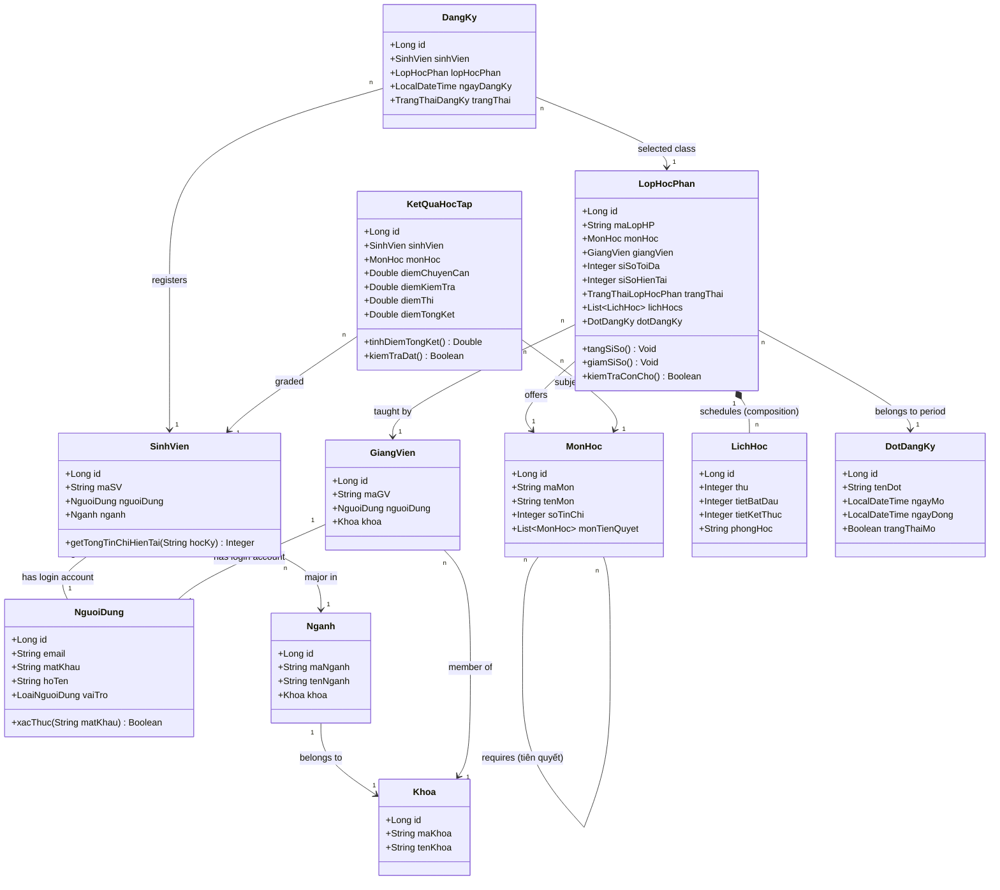

# Tài liệu Thiết kế Lớp (Class Diagram) - Hệ thống Đăng ký Tín chỉ

Tài liệu này trình bày chi tiết về quá trình phân tích danh từ để trích xuất lớp, đặc tả chi tiết cấu trúc các lớp (thuộc tính, phương thức, stereotype) và biểu đồ lớp UML của hệ thống.

---

## 1. Trích xuất lớp (Noun Extraction)

Từ các kịch bản Use Case cốt lõi ở Phase 1 (Đăng ký học phần, Mở lớp học phần, Nhập điểm học phần), chúng tôi lọc ra các danh từ chính và phân loại để tạo các lớp đối tượng:

- **Các danh từ là tác nhân/đối tượng nghiệp vụ**: Sinh viên, Giảng viên, Giáo vụ, Người dùng, Môn học, Lớp học phần, Lịch học, Đợt đăng ký, Kết quả học tập, Khoa, Ngành.
- **Các danh từ là thuộc tính**: Mã sinh viên, Họ tên, Điểm số, Sĩ số tối đa, Phòng học, Thứ, Tiết bắt đầu, Tiết kết thúc, Số tín chỉ...
- **Các danh từ không phải đối tượng phần mềm** (bị loại bỏ): Giỏ tạm thời (được xử lý ở UI hoặc trạng thái DTO), Danh mục môn học gốc (là một danh sách Môn học).

---

## 2. Đặc tả các Lớp Hệ thống (Phân loại theo Stereotype)

Hệ thống được thiết kế theo kiến trúc 4 tầng phân tách trách nhiệm (Stereotypes):
- `<<Entity>>` (Domain Model): Đại diện cho các bảng dữ liệu trong CSDL.
- `<<Repository>>`: Chịu trách nhiệm truy vấn và lưu trữ dữ liệu.
- `<<Service>>`: Chứa toàn bộ các xử lý logic nghiệp vụ và quy tắc nghiệp vụ.
- `<<Controller>>` (Boundary): Điểm tiếp nhận các yêu cầu HTTP từ giao diện người dùng.

### 2.1 Các lớp thực thể (`<<Entity>>`)

#### 1. Lớp `NguoiDung` (Người dùng)
- **Thuộc tính**:
  - `id: Long` (Khóa chính)
  - `email: String` (Địa chỉ email trường - duy nhất)
  - `matKhau: String` (Mật khẩu đã mã hóa BCrypt)
  - `hoTen: String` (Họ và tên)
  - `vaiTro: LoaiNguoiDung` (Enum: SINH_VIEN, GIANG_VIEN, GIAO_VU)
- **Phương thức**:
  - `xacThuc(matKhau: String): Boolean`

#### 2. Lớp `SinhVien`
- **Thuộc tính**:
  - `id: Long` (Khóa chính)
  - `maSV: String` (Mã số sinh viên - duy nhất)
  - `nguoiDung: NguoiDung` (Quan hệ 1-1 với NguoiDung)
  - `nganh: Nganh` (FK ngành học)
- **Phương thức**:
  - `getTongTinChiHienTai(hocKy: String): Integer`

#### 3. Lớp `GiangVien`
- **Thuộc tính**:
  - `id: Long` (Khóa chính)
  - `maGV: String` (Mã giảng viên - duy nhất)
  - `nguoiDung: NguoiDung` (Quan hệ 1-1 với NguoiDung)
  - `khoa: Khoa` (FK khoa)

#### 4. Lớp `MonHoc` (Môn học)
- **Thuộc tính**:
  - `id: Long` (Khóa chính)
  - `maMon: String` (Mã môn học - duy nhất)
  - `tenMon: String` (Tên môn học)
  - `soTinChi: Integer` (Số tín chỉ)
  - `monTienQuyet: List<MonHoc>` (Mối quan hệ N-N tự liên kết)

#### 5. Lớp `LopHocPhan` (Lớp học phần)
- **Thuộc tính**:
  - `id: Long` (Khóa chính)
  - `maLopHP: String` (Mã lớp học phần - duy nhất)
  - `monHoc: MonHoc` (Quan hệ N-1 với MonHoc)
  - `giangVien: GiangVien` (Quan hệ N-1 với GiangVien)
  - `siSoToiDa: Integer` (Số lượng sinh viên tối đa)
  - `siSoHienTai: Integer` (Số lượng sinh viên đã đăng ký thành công)
  - `trangThai: TrangThaiLopHocPhan` (Enum: MO_DANG_KY, DONG_DANG_KY, HUY_LOP, DANG_HOC, KET_THUC)
  - `lichHocs: List<LichHoc>` (Quan hệ 1-N với LichHoc)
  - `dotDangKy: DotDangKy` (Quan hệ N-1 với DotDangKy)
- **Phương thức**:
  - `tangSiSo(): Void`
  - `giamSiSo(): Void`
  - `kiemTraConCho(): Boolean`

#### 6. Lớp `LichHoc` (Lịch học chi tiết)
- **Thuộc tính**:
  - `id: Long`
  - `thu: Integer` (Thứ trong tuần: 2 đến 7, 8 đại diện Chủ Nhật)
  - `tietBatDau: Integer` (Tiết 1 đến 12)
  - `tietKetThuc: Integer`
  - `phongHoc: String`
  - `lopHocPhan: LopHocPhan` (Quan hệ N-1 ngược về LopHocPhan)

#### 7. Lớp `DangKy` (Phiếu đăng ký học phần)
- **Thuộc tính**:
  - `id: Long` (Khóa chính)
  - `sinhVien: SinhVien` (Quan hệ N-1 với SinhVien)
  - `lopHocPhan: LopHocPhan` (Quan hệ N-1 với LopHocPhan)
  - `ngayDangKy: LocalDateTime`
  - `trangThai: TrangThaiDangKy` (Enum: THANH_CONG, DA_HUY, CHO_DUYET)

#### 8. Lớp `KetQuaHocTap` (Điểm số học phần)
- **Thuộc tính**:
  - `id: Long`
  - `sinhVien: SinhVien` (Quan hệ N-1 với SinhVien)
  - `monHoc: MonHoc` (Quan hệ N-1 với MonHoc)
  - `diemChuyenCan: Double`
  - `diemKiemTra: Double`
  - `diemThi: Double`
  - `diemTongKet: Double`
- **Phương thức**:
  - `tinhDiemTongKet(): Double`
  - `kiemTraDat(): Boolean`

---

## 3. Biểu đồ Class Diagram tổng thể

Dưới đây là sơ đồ cấu trúc tĩnh mô tả các thực thể dữ liệu và mối quan hệ chi tiết của chúng.

### 3.1 Biểu đồ hình ảnh (PNG độ phân giải cao)
Chi tiết file biểu đồ lưu trữ tại: [class-diagram.png](file:///c:/Users/ADMIN/Documents/PTTKPM/PTTKPM25-26_ClassN05_Nhom-21/Design/sketches/class-diagram.png)

### 3.2 Biểu đồ nguồn Draw.io
Chi tiết file vẽ gốc có thể sửa được lưu trữ tại: [class-diagram.drawio](file:///c:/Users/ADMIN/Documents/PTTKPM/PTTKPM25-26_ClassN05_Nhom-21/Design/class-diagram.drawio)

### 3.3 Biểu đồ dạng mã nguồn Mermaid

---

## 4. Đặc tả lớp Dịch vụ và Điều khiển (Services & Controllers)

Để hệ thống hoạt động, chúng tôi thiết kế thêm các lớp điều khiển luồng và nghiệp vụ:

### 4.1 Lớp `DangKyController` (Tầng Boundary)
- **Phương thức**:
  - `POST /api/registrations (studentId, sectionId): ResponseEntity`
  - `DELETE /api/registrations/{id}: ResponseEntity`
  - `GET /api/students/{id}/schedule: ResponseEntity`

### 4.2 Lớp `IDangKyService` (Tầng Control)
- **Phương thức**:
  - `thucHienDangKy(sinhVienId: Long, lopHPId: Long): DangKy`
  - `huyDangKy(dangKyId: Long): Void`
  - `layLichHocSinhVien(sinhVienId: Long): List<LichHoc>`
  - `kiemTraDieuKienTienQuyet(sinhVienId: Long, monHocId: Long): Boolean`
  - `kiemTraTrungLich(sinhVienId: Long, lichHocs: List<LichHoc>): Boolean`
