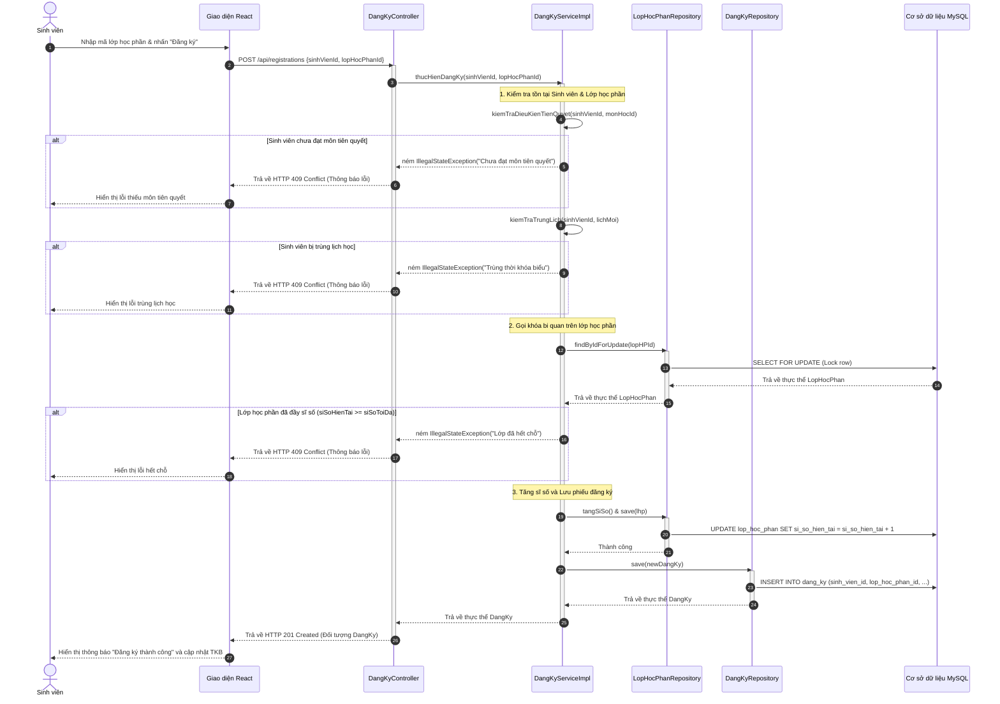
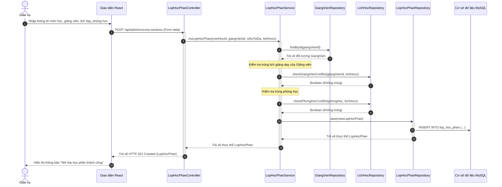

# Tài liệu Thiết kế Tương tác (Sequence Diagram) - Hệ thống Đăng ký Tín chỉ

Tài liệu này đặc tả cách thức các đối tượng trong hệ thống giao tiếp với nhau theo trình tự thời gian để thực hiện các nghiệp vụ chính.

---

## 1. Biểu đồ Sequence Diagram cho UC-01: Đăng ký học phần

Biểu đồ này mô tả luồng đăng ký học phần của Sinh viên, bao gồm các bước xác thực, kiểm tra điều kiện tiên quyết, trùng lịch học, kiểm tra sĩ số, và khóa dòng bi quan (Pessimistic Locking) để đảm bảo an toàn đồng thời.

### 1.1 Biểu đồ hình ảnh (PNG độ phân giải cao)
Chi tiết file biểu đồ trình tự lưu trữ tại: [sequence-diagram-registration.png](file:///c:/Users/ADMIN/Documents/PTTKPM/PTTKPM25-26_ClassN05_Nhom-21/Design/sketches/sequence-diagram-registration.png)

### 1.2 Biểu đồ dạng mã nguồn Mermaid

---

## 2. Biểu đồ Sequence Diagram cho UC-02: Mở lớp học phần

Mô tả luồng tương tác khi Giáo vụ tạo lập một lớp học phần mới trên hệ thống, hệ thống thực hiện kiểm tra chéo lịch giảng dạy của Giảng viên và tính khả dụng của phòng học.

---

## 3. Liên kết sơ đồ bản vẽ kỹ thuật
Ảnh thiết kế biểu đồ trình tự nghiệp vụ đăng ký tín chỉ chi tiết được lưu trữ tại:
[Design/sketches/sequence-diagram-registration.png](file:///c:/Users/ADMIN/Documents/PTTKPM/PTTKPM25-26_ClassN05_Nhom-21/Design/sketches/sequence-diagram-registration.png)
