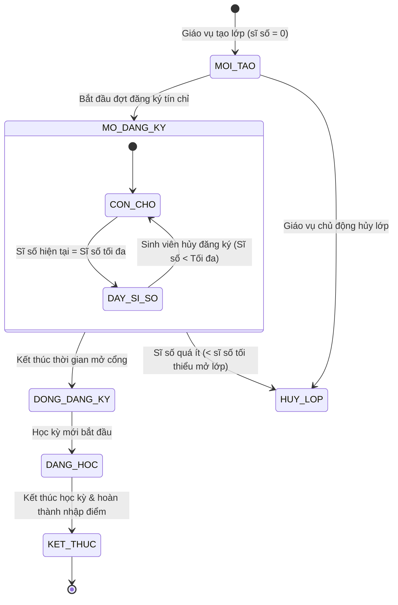
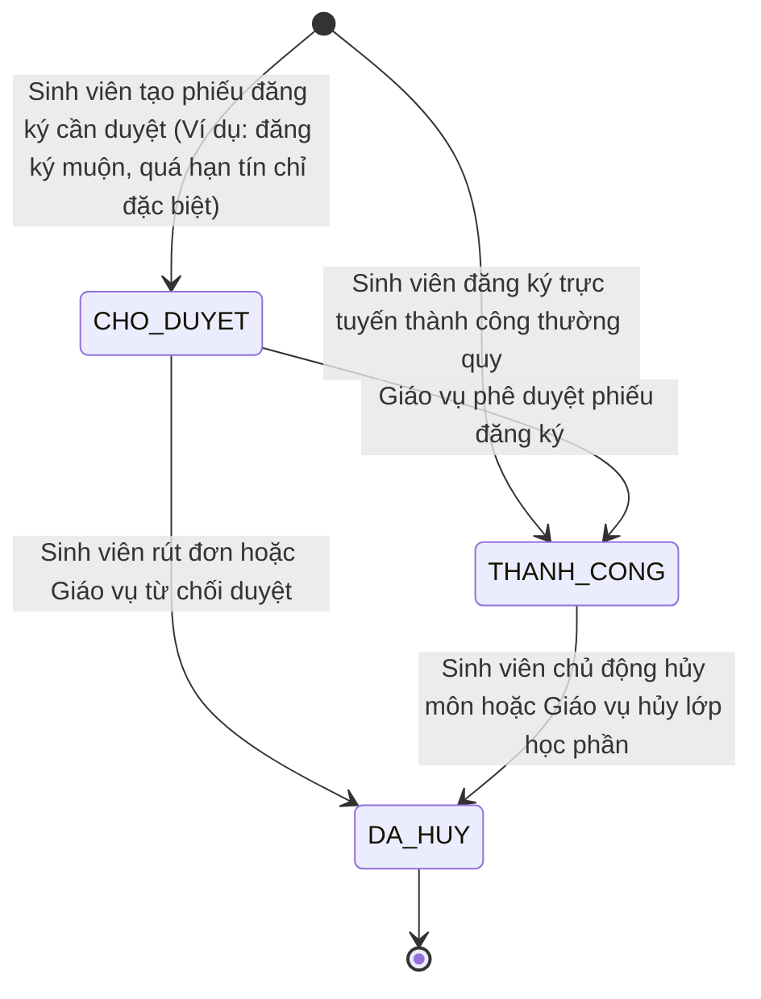
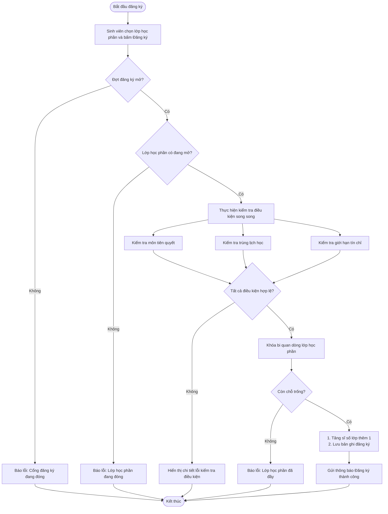

# Tài liệu Thiết kế Trạng thái và Hành vi - Hệ thống Đăng ký Tín chỉ

Tài liệu này đặc tả vòng đời trạng thái của các thực thể phức tạp trong hệ thống và sơ đồ hoạt động (luồng quy trình) cho nghiệp vụ Đăng ký học phần.

---

## 1. Biểu đồ trạng thái (State Machine Diagram) của Lớp học phần

Thực thể `LopHocPhan` có vòng đời phức tạp bắt đầu từ khi được Giáo vụ mở cho đến khi kết thúc học kỳ.

### 1.1 Biểu đồ hình ảnh (PNG độ phân giải cao)
Chi tiết file biểu đồ trạng thái lưu trữ tại: [state-diagram-lophocphan.png](file:///c:/Users/ADMIN/Documents/PTTKPM/PTTKPM25-26_ClassN05_Nhom-21/Design/sketches/state-diagram-lophocphan.png)

### 1.2 Biểu đồ dạng mã nguồn Mermaid

---

## 2. Biểu đồ trạng thái (State Machine Diagram) của Đăng ký học phần (DangKy)

Thực thể `DangKy` (Phiếu đăng ký) đại diện cho yêu cầu đăng ký một lớp học phần của sinh viên, trải qua các trạng thái từ chờ duyệt cho đến thành công hoặc bị hủy.

### 2.1 Biểu đồ hình ảnh (PNG độ phân giải cao)
Chi tiết file biểu đồ trạng thái lưu trữ tại: [state-diagram-dangky.png](file:///c:/Users/ADMIN/Documents/PTTKPM/PTTKPM25-26_ClassN05_Nhom-21/Design/sketches/state-diagram-dangky.png)

### 2.2 Biểu đồ dạng mã nguồn Mermaid

---

## 3. Biểu đồ hoạt động (Activity Diagram) cho Quy trình đăng ký môn học

Mô tả chi tiết luồng xử lý của hệ thống khi Sinh viên nhấn nút đăng ký một lớp học phần, bao gồm các bước kiểm tra điều kiện tuần tự và song song.

### 3.1 Biểu đồ hình ảnh (PNG độ phân giải cao)
Chi tiết file biểu đồ hoạt động lưu trữ tại: [activity-diagram-registration.png](file:///c:/Users/ADMIN/Documents/PTTKPM/PTTKPM25-26_ClassN05_Nhom-21/Design/sketches/activity-diagram-registration.png)

### 3.2 Biểu đồ dạng mã nguồn Mermaid

---

## 4. Liên kết sơ đồ hình ảnh xuất bản
Các sơ đồ hình ảnh chất lượng cao lưu trữ tại:
- Biểu đồ trạng thái Lớp học phần: [Design/sketches/state-diagram-lophocphan.png](file:///c:/Users/ADMIN/Documents/PTTKPM/PTTKPM25-26_ClassN05_Nhom-21/Design/sketches/state-diagram-lophocphan.png)
- Biểu đồ trạng thái Đăng ký: [Design/sketches/state-diagram-dangky.png](file:///c:/Users/ADMIN/Documents/PTTKPM/PTTKPM25-26_ClassN05_Nhom-21/Design/sketches/state-diagram-dangky.png)
- Biểu đồ hoạt động: [Design/sketches/activity-diagram-registration.png](file:///c:/Users/ADMIN/Documents/PTTKPM/PTTKPM25-26_ClassN05_Nhom-21/Design/sketches/activity-diagram-registration.png)
