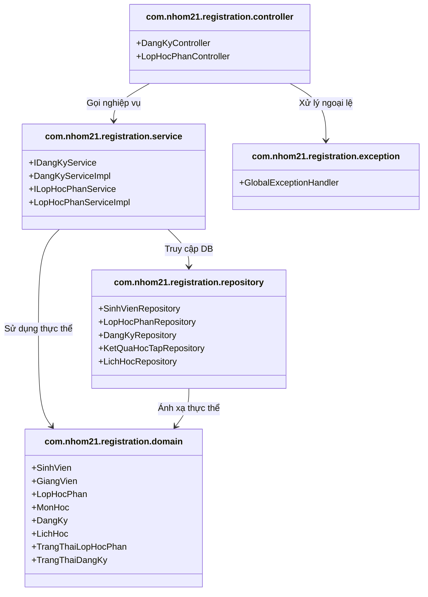

# Tài liệu Thiết kế Kiến trúc & Triển khai (SDD) - Hệ thống Đăng ký Tín chỉ

Tài liệu này đặc tả kiến trúc phần mềm, cấu trúc các thành phần phân gói (Package) và mô hình triển khai vật lý (Deployment) của Hệ thống Quản lý Đăng ký Học theo Tín chỉ.

---

## 1. Kiến trúc Hệ thống (System Architecture)

Hệ thống được thiết kế theo kiến trúc **Layered Monolith (Kiến trúc phân tầng)** với 4 tầng nghiệp vụ cơ bản, tách biệt rõ ràng trách nhiệm của từng thành phần (Separation of Concerns).

```
┌────────────────────────────────────────────────────────┐
│             Tầng Presentation (Controller)             │
│   - Tiếp nhận HTTP Request từ Client (React JS)        │
│   - Điều hướng và chuyển tiếp nghiệp vụ xuống Service   │
│   - Trả về HTTP Response (JSON / Status Code)          │
└───────────────────────────┬────────────────────────────┘
                            ▼
┌────────────────────────────────────────────────────────┐
│                 Tầng Business (Service)                │
│   - Chứa toàn bộ các Quy tắc nghiệp vụ (Business Rules)│
│   - Điều phối giao dịch dữ liệu (@Transactional)       │
│   - Thực hiện kiểm tra điều kiện đăng ký               │
└───────────────────────────┬────────────────────────────┘
                            ▼
┌────────────────────────────────────────────────────────┐
│             Tầng Data Access (Repository)              │
│   - Giao tiếp trực tiếp với Cơ sở dữ liệu qua JPA      │
│   - Sử dụng Spring Data JPA Repositories               │
│   - Cài đặt cơ chế Khóa bi quan (Pessimistic Locking)  │
└───────────────────────────┬────────────────────────────┘
                            ▼
┌────────────────────────────────────────────────────────┐
│                Tầng Cơ sở dữ liệu (MySQL)              │
│   - Lưu trữ dữ liệu quan hệ chuẩn hóa 3NF               │
│   - Đảm bảo tính nhất quán dữ liệu (ACID)              │
└────────────────────────────────────────────────────────┘
```

---

## 2. Biểu đồ phân gói (Package Diagram)

Package Diagram thể hiện sự phân rã của mã nguồn Java trong project Spring Boot. Nguyên tắc cốt lõi: **Sự phụ thuộc chỉ chạy theo một chiều từ trên xuống dưới**, tầng dưới không phụ thuộc ngược lại tầng trên.

### 2.1 Biểu đồ nguồn Mermaid


### 2.2 Ảnh biểu đồ xuất bản
*   Đường dẫn ảnh sơ đồ phân gói chất lượng cao: [package-diagram.png](file:///c:/Users/ADMIN/Documents/PTTKPM/PTTKPM25-26_ClassN05_Nhom-21/Design/sketches/package-diagram.png)


---

## 3. Biểu đồ triển khai (Deployment Diagram)

Deployment Diagram mô tả kiến trúc phân bổ phần cứng, các node chạy phần mềm và các giao thức mạng được sử dụng để kết nối giữa các node vật lý.

### 3.1 Biểu đồ nguồn Mermaid
```mermaid
deploymentDiagram
  node ClientDevice ["Thiết bị Sinh viên / Giáo vụ (Client Device)"] {
    node Browser ["Web Browser (Chrome, Edge, Safari)"] {
      artifact ReactApp ["React SPA (Vite + TS)"]
    }
  }

  node AppServer ["Application Server (Spring Boot Host)"] {
    node Tomcat ["Embedded Tomcat Server (Port 8080)"] {
      artifact SpringBootJar ["registration-system.jar"]
    }
  }

  node DatabaseServer ["Database Server (MySQL Instance)"] {
    node MySQL ["MySQL Database Engine (Port 3306)"] {
      database RelationalDB ["registration_db (InnoDB Engine)"]
    }
  }

  Browser -- "HTTPS / JSON API" --> Tomcat
  Tomcat -- "JDBC Driver / TCP" --> MySQL
```

### 3.2 Ảnh biểu đồ xuất bản
*   Đường dẫn ảnh sơ đồ triển khai chất lượng cao: [deployment-diagram.png](file:///c:/Users/ADMIN/Documents/PTTKPM/PTTKPM25-26_ClassN05_Nhom-21/Design/sketches/deployment-diagram.png)


---

## 4. Đặc tả API và Xử lý ngoại lệ (API Specification & Exception Handling)

### 4.1 Cơ chế Xử lý Ngoại lệ Tập trung (Global Exception Handling)
Để tách biệt mã nguồn xử lý lỗi ra khỏi luồng xử lý chính trong Controller, hệ thống áp dụng mẫu thiết kế **Global Exception Handler** dùng Spring AOP (`@RestControllerAdvice`).

*   Khi Tầng Service ném ra `IllegalArgumentException` (lỗi không tìm thấy dữ liệu) $\rightarrow$ Hệ thống chuyển đổi thành HTTP status **404 Not Found**.
*   Khi Tầng Service ném ra `IllegalStateException` (lỗi vi phạm quy tắc ràng buộc hoặc hết chỗ) $\rightarrow$ Hệ thống chuyển đổi thành HTTP status **409 Conflict**.
*   Các lỗi không xác định khác $\rightarrow$ Trả về HTTP status **500 Internal Server Error**.

### 4.2 Danh sách REST APIs tiêu chuẩn

#### 1. Đăng ký học phần mới
*   **Method**: `POST`
*   **Path**: `/api/registrations`
*   **Request Body**:
    ```json
    {
      "sinhVienId": 1,
      "lopHocPhanId": 2
    }
    ```
*   **Success Response**: `201 Created` kèm thông tin phiếu đăng ký.
*   **Error Responses**:
    *   `404 Not Found`: Không tìm thấy Sinh viên hoặc Lớp học phần.
    *   `409 Conflict`: Trùng lịch học, thiếu môn tiên quyết, lớp đã đầy chỗ, hoặc cổng đăng ký đang đóng.

#### 2. Hủy đăng ký học phần
*   **Method**: `DELETE`
*   **Path**: `/api/registrations/{id}`
*   **Success Response**: `200 OK` với thông điệp hủy thành công.
*   **Error Responses**:
    *   `404 Not Found`: Không tìm thấy bản ghi đăng ký.
    *   `409 Conflict`: Phiếu đăng ký đã bị hủy từ trước.

#### 3. Lấy thời khóa biểu sinh viên
*   **Method**: `GET`
*   **Path**: `/api/registrations/student/{id}/schedule`
*   **Success Response**: `200 OK` kèm danh sách lịch học của sinh viên.

#### 4. Giáo vụ quản lý danh sách Lớp học phần (CRUD)
*   **Lấy danh sách**: `GET /api/admin/course-sections` $\rightarrow$ Trả về danh sách lớp học phần hiện có.
*   **Tạo mới lớp**: `POST /api/admin/course-sections` $\rightarrow$ Trả về lớp học phần vừa tạo.
*   **Cập nhật lớp**: `PUT /api/admin/course-sections/{id}` $\rightarrow$ Trả về dữ liệu đã cập nhật.
*   **Xóa lớp**: `DELETE /api/admin/course-sections/{id}` $\rightarrow$ Trả về thông điệp thành công.
