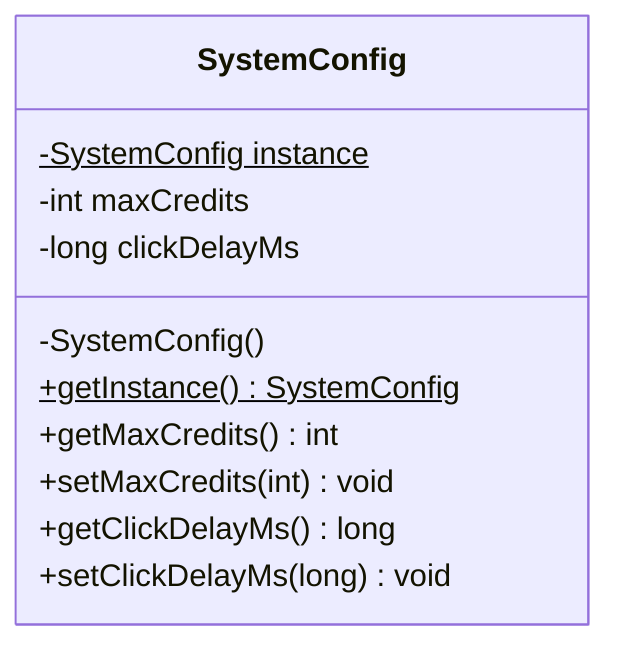
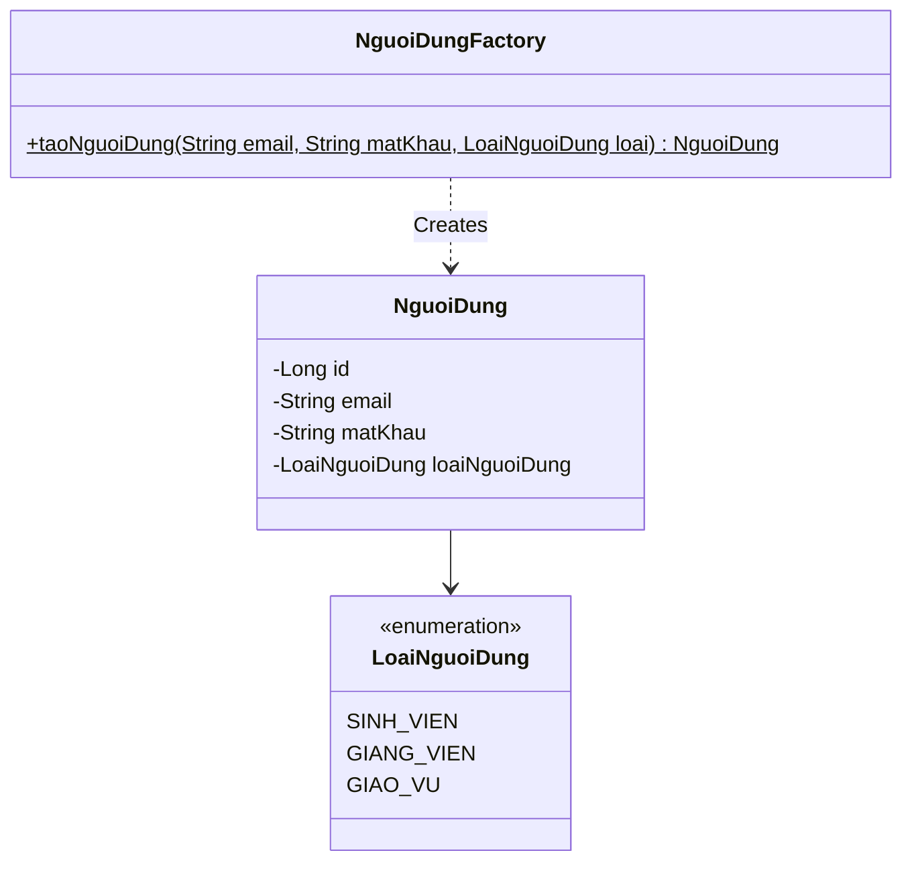
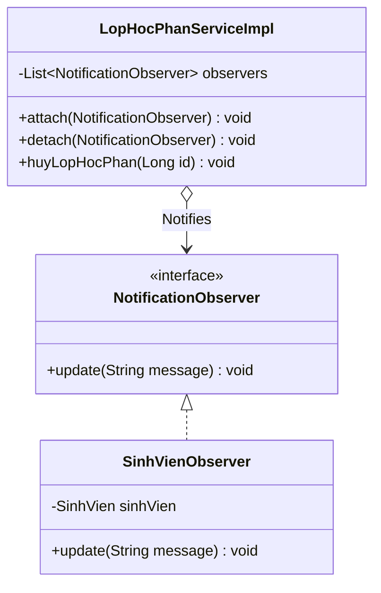
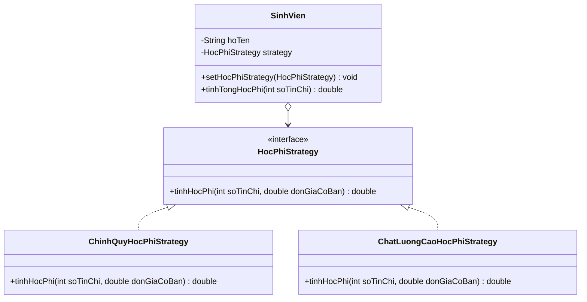

# Tài liệu Thiết kế Mẫu (Design Patterns Specification) - Hệ thống Đăng ký Tín chỉ

Tài liệu này đặc tả cách thức áp dụng các mẫu thiết kế (Design Patterns) tiêu chuẩn vào dự án nhằm nâng cao tính linh hoạt, khả năng mở rộng, giảm thiểu sự liên kết chặt chẽ (loose coupling) và tuân thủ các nguyên lý SOLID.

---

## 1. Mẫu Thiết kế Singleton (Singleton Pattern)

### 1.1 Vấn đề giải quyết
Hệ thống cần một nơi lưu trữ cấu hình hệ thống duy nhất (ví dụ: số tín chỉ tối đa, khoảng thời gian chống click spam) được chia sẻ toàn cục. Việc tạo nhiều đối tượng cấu hình sẽ lãng phí tài nguyên và dẫn đến không đồng bộ dữ liệu cấu hình.

### 1.2 Giải pháp & Cài đặt
Xây dựng lớp `SystemConfig` áp dụng mẫu Singleton bảo mật đa luồng (Thread-safe) sử dụng kỹ thuật **Double-Checked Locking** kết hợp từ khóa `volatile`.

*   Mã nguồn chi tiết lưu tại: [SystemConfig.java](file:///c:/Users/ADMIN/Documents/PTTKPM/PTTKPM25-26_ClassN05_Nhom-21/SRC/backend/src/main/java/com/nhom21/registration/config/SystemConfig.java)

---

## 2. Mẫu Thiết kế Factory (Factory Method Pattern)

### 2.1 Vấn đề giải quyết
Hệ thống có nhiều vai trò người dùng khác nhau (`SinhVien`, `GiangVien`, `GiaoVu`). Khi tạo lập tài khoản, hệ thống cần khởi tạo thực thể `NguoiDung` tương ứng với các thuộc tính phân quyền mặc định. Việc viết code khởi tạo trực tiếp (`new`) rải rác trong Controller sẽ gây phụ thuộc cứng và khó mở rộng khi có loại người dùng mới.

### 2.2 Giải pháp & Cài đặt
Cài đặt `NguoiDungFactory` đóng gói logic khởi tạo đối tượng `NguoiDung` dựa trên tham số truyền vào là `LoaiNguoiDung`.

*   Mã nguồn chi tiết lưu tại: [NguoiDungFactory.java](file:///c:/Users/ADMIN/Documents/PTTKPM/PTTKPM25-26_ClassN05_Nhom-21/SRC/backend/src/main/java/com/nhom21/registration/factory/NguoiDungFactory.java)

---

## 3. Mẫu Thiết kế Observer (Observer Pattern)

### 3.1 Vấn đề giải quyết
Khi Giáo vụ thực hiện hủy một lớp học phần (`TrangThaiLopHocPhan.HUY_LOP`), hệ thống cần tự động gửi thông báo đến toàn bộ các sinh viên đã đăng ký lớp học đó để họ chọn lớp khác. Lớp quản lý dịch vụ học phần (`LopHocPhanServiceImpl`) không nên liên kết trực tiếp với các kênh gửi tin nhắn (Email, SMS, In-app) để tránh kết dính chặt chẽ.

### 3.2 Giải pháp & Cài đặt
Cài đặt mẫu thiết kế Observer gồm:
*   `NotificationObserver` (Interface): Định nghĩa phương thức nhận tin.
*   `SinhVienObserver` (Concrete Observer): Bọc đối tượng `SinhVien` để nhận thông báo.
*   `LopHocPhanServiceImpl` đóng vai trò là Subject (Publishers) quản lý danh sách đăng ký và phát đi thông điệp.

*   Mã nguồn chi tiết: [NotificationObserver.java](file:///c:/Users/ADMIN/Documents/PTTKPM/PTTKPM25-26_ClassN05_Nhom-21/SRC/backend/src/main/java/com/nhom21/registration/observer/NotificationObserver.java) và [SinhVienObserver.java](file:///c:/Users/ADMIN/Documents/PTTKPM/PTTKPM25-26_ClassN05_Nhom-21/SRC/backend/src/main/java/com/nhom21/registration/observer/SinhVienObserver.java)

---

## 4. Mẫu Thiết kế Strategy (Strategy Pattern)

### 4.1 Vấn đề giải quyết
Mỗi hệ đào tạo sinh viên có một cách tính học phí khác nhau (ví dụ: Hệ đại trà tính theo số tín chỉ nhân đơn giá chuẩn; Hệ Chất lượng cao nhân thêm hệ số 2.0; Hệ liên thông được giảm giá 10%). Nếu dùng nhiều câu lệnh điều kiện `if-else` lồng nhau để tính toán học phí trong service, mã nguồn sẽ trở nên rất khó bảo trì và vi phạm nguyên lý Open/Closed (OCP).

### 4.2 Giải pháp & Cài đặt
Định nghĩa interface `HocPhiStrategy` đóng gói thuật toán tính toán học phí, và các lớp cài đặt cụ thể:
*   `ChinhQuyHocPhiStrategy`
*   `ChatLuongCaoHocPhiStrategy`

*   Mã nguồn chi tiết: [HocPhiStrategy.java](file:///c:/Users/ADMIN/Documents/PTTKPM/PTTKPM25-26_ClassN05_Nhom-21/SRC/backend/src/main/java/com/nhom21/registration/strategy/HocPhiStrategy.java), [ChinhQuyHocPhiStrategy.java](file:///c:/Users/ADMIN/Documents/PTTKPM/PTTKPM25-26_ClassN05_Nhom-21/SRC/backend/src/main/java/com/nhom21/registration/strategy/ChinhQuyHocPhiStrategy.java) và [ChatLuongCaoHocPhiStrategy.java](file:///c:/Users/ADMIN/Documents/PTTKPM/PTTKPM25-26_ClassN05_Nhom-21/SRC/backend/src/main/java/com/nhom21/registration/strategy/ChatLuongCaoHocPhiStrategy.java)

---

## 5. Liên kết Sơ đồ UML xuất bản
*   Sơ đồ UML tổng hợp các mẫu thiết kế lưu tại: [Design/sketches/design-patterns-uml.png](file:///c:/Users/ADMIN/Documents/PTTKPM/PTTKPM25-26_ClassN05_Nhom-21/Design/sketches/design-patterns-uml.png)
