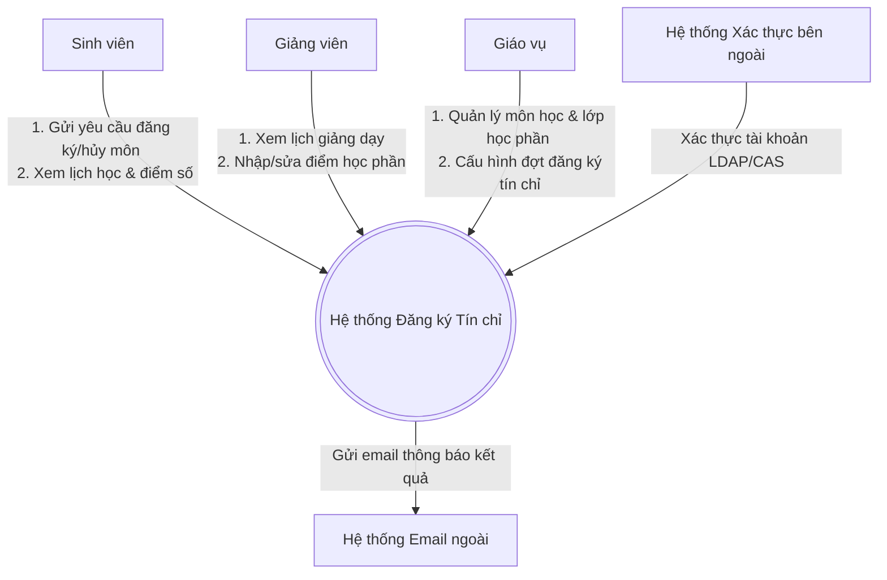

# Tài liệu Đặc tả Yêu cầu Phần mềm (SRS) - Hệ thống Đăng ký Tín chỉ

Tài liệu Đặc tả Yêu cầu Phần mềm (SRS) này xác định các yêu cầu chức năng, phi chức năng và hành vi nghiệp vụ cho hệ thống "Hệ thống Quản lý Đăng ký Học theo Tín chỉ".

---

## 1. Giới thiệu

### 1.1 Bối cảnh & Mục tiêu
Trong môi trường đào tạo theo học chế tín chỉ, việc đăng ký học tập của sinh viên đóng vai trò cốt lõi. Nhằm tự động hóa quy trình, giảm tải áp lực cho giáo vụ và hạn chế tối đa các tranh chấp về sĩ số hay trùng lịch học, dự án này hướng tới phát triển một ứng dụng web hiện đại, ổn định, hỗ trợ đăng ký tín chỉ hiệu năng cao.

### 1.2 Phạm vi hệ thống
- **Trong phạm vi**:
  - Phân quyền người dùng (Sinh viên, Giảng viên, Giáo vụ).
  - Giáo vụ thiết lập đợt đăng ký môn học, tạo các lớp học phần và phân công giảng viên.
  - Sinh viên tra cứu lớp, kiểm tra điều kiện môn tiên quyết, kiểm tra trùng lịch và đăng ký/hủy đăng ký lớp học phần trực tuyến.
  - Giảng viên xem lịch dạy, danh sách lớp học phần phụ trách và nhập điểm trực tiếp.
- **Ngoài phạm vi**:
  - Thanh toán học phí trực tuyến (chỉ ghi nhận học phí phát sinh).
  - Quản lý ký túc xá hay thư viện trường học.

---

## 2. Mô tả tổng thể & Sơ đồ ngữ cảnh (Context Diagram)

Hệ thống đóng vai trò trung tâm xử lý dữ liệu đăng ký tín chỉ, tương tác trực tiếp với Sinh viên, Giảng viên, Giáo vụ và Hệ thống Xác thực ngoài của nhà trường.



---

## 3. Danh sách Actor (Tác nhân)

| Actor | Loại | Mô tả |
| :--- | :--- | :--- |
| **Sinh viên** | Chính | Người dùng cuối thực hiện tra cứu lớp học phần, đăng ký học tập và xem lịch học/kết quả học tập. |
| **Giảng viên** | Chính | Người dùng cuối thực hiện xem lịch dạy của mình và cập nhật điểm số cho sinh viên trong lớp học phần đảm nhận. |
| **Giáo vụ** | Chính | Quản trị viên quản lý cấu hình các đợt đăng ký học, quản lý danh mục môn học, tạo lớp học phần, phân phòng học, giới hạn sĩ số. |
| **Hệ thống Xác thực** | Phụ | Hệ thống trung gian bên ngoài xác thực thông tin đăng nhập của người dùng. |
| **Hệ thống Email** | Phụ | Hệ thống gửi thông báo tự động (mở cổng, đăng ký thành công) tới người dùng. |

---

## 4. Yêu cầu hệ thống

### 4.1 Yêu cầu chức năng (Functional Requirements - FR)
Tất cả các yêu cầu chức năng phải được mô tả rõ ràng theo định dạng chuẩn:

| Mã số | Tên yêu cầu | Mô tả chi tiết yêu cầu chức năng |
| :--- | :--- | :--- |
| **FR-01** | Đăng nhập tài khoản | Hệ thống phải cho phép người dùng đăng nhập bằng tài khoản email trường thông qua hệ thống xác thực. |
| **FR-02** | Xem lịch học | Hệ thống phải hiển thị thời khóa biểu cá nhân của Sinh viên theo định dạng lưới lịch tuần. |
| **FR-03** | Tra cứu lớp học phần | Hệ thống phải cho phép Sinh viên tìm kiếm lớp học phần theo tên môn học, mã môn học hoặc giảng viên. |
| **FR-04** | Đăng ký lớp học phần | Hệ thống phải ghi nhận yêu cầu đăng ký lớp học phần của Sinh viên khi đợt đăng ký đang mở. |
| **FR-05** | Hủy lớp học phần | Hệ thống phải cho phép Sinh viên rút tên khỏi lớp học phần đã đăng ký trước khi cổng đăng ký đóng. |
| **FR-06** | Kiểm tra môn tiên quyết | Hệ thống phải ngăn chặn Sinh viên đăng ký lớp học phần nếu chưa đạt điểm điều kiện ở môn tiên quyết. |
| **FR-07** | Kiểm tra trùng lịch học | Hệ thống phải tự động kiểm tra trùng giờ học (thứ, tiết bắt đầu - kết thúc) và từ chối nếu bị trùng lịch. |
| **FR-08** | Kiểm tra giới hạn tín chỉ | Hệ thống phải giới hạn tổng số tín chỉ đăng ký của Sinh viên trong học kỳ nằm trong khoảng `[Min, Max]`. |
| **FR-09** | Cập nhật sĩ số tự động | Hệ thống phải tăng sĩ số hiện tại của lớp học phần lên 1 đơn vị khi có sinh viên đăng ký thành công và giảm đi 1 khi hủy. |
| **FR-10** | Giới hạn sĩ số tối đa | Hệ thống phải từ chối yêu cầu đăng ký nếu lớp học phần đã đạt đủ sĩ số tối đa quy định. |
| **FR-11** | Xem lịch dạy | Hệ thống phải hiển thị thời khóa biểu giảng dạy chi tiết cho Giảng viên. |
| **FR-12** | Nhập điểm học phần | Hệ thống phải cho phép Giảng viên nhập điểm quá trình, điểm thi và tự động tính điểm tổng kết. |
| **FR-13** | Quản lý đợt đăng ký | Hệ thống phải cho phép Giáo vụ thiết lập đợt đăng ký tín chỉ (ngày bắt đầu, ngày kết thúc, giới hạn tín chỉ). |
| **FR-14** | Quản lý lớp học phần | Hệ thống phải cho phép Giáo vụ thực hiện CRUD (Thêm, Xóa, Sửa, Đọc) thông tin lớp học phần. |
| **FR-15** | Kiểm tra trạng thái cổng | Hệ thống phải từ chối tất cả yêu cầu đăng ký/hủy nếu trạng thái cổng đăng ký học phần đang khóa. |
| **FR-16** | Xem kết quả học tập | Hệ thống phải hiển thị bảng điểm chi tiết của Sinh viên qua các học kỳ. |

### 4.2 Yêu cầu phi chức năng (Non-Functional Requirements - NFR)
- **NFR-01 (Bảo mật)**: Mật khẩu người dùng lưu trữ trong cơ sở dữ liệu phải được băm bằng thuật toán BCrypt. Hệ thống sử dụng JWT (JSON Web Token) để xác thực và phân quyền RBAC (Role-Based Access Control) cho từng API.
- **NFR-02 (Hiệu năng)**: Thời gian phản hồi cho các yêu cầu đọc dữ liệu tra cứu lớp phải nhỏ hơn 1.5 giây. Thời gian xử lý transaction đăng ký học phần trong điều kiện tải cao phải nhỏ hơn 3 giây.
- **NFR-03 (Khả dụng)**: Hệ thống phải đạt tỷ lệ hoạt động liên tục (Uptime) tối thiểu là 99.5% trong suốt thời gian mở cổng đăng ký học phần.
- **NFR-04 (Khả năng chịu tải)**: Hệ thống phải hỗ trợ tối thiểu 1,000 người dùng truy cập đồng thời và xử lý tối thiểu 200 transaction đăng ký/giây mà không bị sập hay mất dữ liệu.
- **NFR-05 (Dễ sử dụng)**: Giao diện người dùng phải hiển thị tốt trên cả máy tính để bàn (Desktop) và điện thoại di động (Responsive Layout), các thông báo lỗi nghiệp vụ phải hiển thị rõ ràng bằng tiếng Việt.

---

## 5. Ma trận Actor - Use Case

| Use Case | Sinh viên | Giảng viên | Giáo vụ | Hệ thống ngoài |
| :--- | :---: | :---: | :---: | :---: |
| **UC-01: Đăng ký học phần** | X | | | |
| **UC-02: Hủy đăng ký học phần** | X | | | |
| **UC-03: Tra cứu lớp học phần** | X | | X | |
| **UC-04: Xem lịch học cá nhân** | X | | | |
| **UC-05: Xem kết quả học tập** | X | | | |
| **UC-06: Xem lịch dạy** | | X | | |
| **UC-07: Nhập điểm học phần** | | X | | |
| **UC-08: Sửa điểm học phần** | | X | | |
| **UC-09: Thêm/Sửa lớp học phần** | | | X | |
| **UC-10: Cấu hình đợt đăng ký** | | | X | |
| **UC-11: Quản lý môn học** | | | X | |
| **UC-12: Phân công Giảng viên** | | | X | |
| **UC-13: Khóa/Mở cổng đăng ký** | | | X | |
| **UC-14: Xác thực người dùng** | X | X | X | X (LDAP CAS) |

---

## 6. Biểu đồ Use Case tổng thể

Biểu đồ dưới đây biểu diễn các Use Case và các tác nhân tương tác cùng mối liên kết phụ thuộc `<<include>>` và `<<extend>>`.

### 6.1 Biểu đồ hình ảnh (PNG độ phân giải cao)
Chi tiết file biểu đồ lưu trữ tại: [use-case-diagram.png](file:///c:/Users/ADMIN/Documents/PTTKPM/PTTKPM25-26_ClassN05_Nhom-21/Design/sketches/use-case-diagram.png)


### 6.2 Biểu đồ dạng mã nguồn (Mermaid)
```mermaid
  left_to_right_direction
  actor SinhVien as "Sinh viên"
  actor GiangVien as "Giảng viên"
  actor GiaoVu as "Giáo vụ"

  rectangle HeThong {
    usecase UC01 as "UC-01: Đăng ký học phần"
    usecase UC02 as "UC-02: Hủy học phần"
    usecase UC03 as "UC-03: Tra cứu lớp HP"
    usecase UC04 as "UC-04: Xem lịch học"
    usecase UC05 as "UC-05: Xem kết quả học tập"
    
    usecase UC06 as "UC-06: Xem lịch dạy"
    usecase UC07 as "UC-07: Nhập điểm học phần"
    
    usecase UC09 as "UC-09: Quản lý lớp HP"
    usecase UC10 as "UC-10: Cấu hình đợt ĐK"
    usecase UC13 as "UC-13: Khóa/Mở cổng ĐK"

    usecase UC_CheckPrereq as "Kiểm tra môn tiên quyết"
    usecase UC_CheckSchedule as "Kiểm tra trùng lịch"
    usecase UC_CheckCredit as "Kiểm tra giới hạn tín chỉ"
    usecase UC_CheckSlot as "Kiểm tra sĩ số"
    usecase UC_ValidateAuth as "Xác thực tài khoản"

    %% Mối liên kết include
    UC01 ..> UC_CheckPrereq : <<include>>
    UC01 ..> UC_CheckSchedule : <<include>>
    UC01 ..> UC_CheckCredit : <<include>>
    UC01 ..> UC_CheckSlot : <<include>>
    
    UC01 ..> UC_ValidateAuth : <<include>>
    UC07 ..> UC_ValidateAuth : <<include>>
    UC09 ..> UC_ValidateAuth : <<include>>
    
    %% Mối liên kết extend
    UC03 <.. UC01 : <<extend>> (Chọn đăng ký)
  }

  SinhVien --> UC01
  SinhVien --> UC02
  SinhVien --> UC03
  SinhVien --> UC04
  SinhVien --> UC05

  GiangVien --> UC06
  GiangVien --> UC07

  GiaoVu --> UC09
  GiaoVu --> UC10
  GiaoVu --> UC13
```

---

## 7. Kịch bản Use Case chi tiết

Dưới đây là kịch bản đặc tả chi tiết cho 3 Use Case cốt lõi nhất của hệ thống.

### 7.1 Kịch bản Use Case UC-01: Đăng ký học phần

| Mục | Nội dung chi tiết kịch bản |
| :--- | :--- |
| **Mã số Use Case** | **UC-01** |
| **Tên Use Case** | **Đăng ký học phần** |
| **Tác nhân chính** | Sinh viên |
| **Tác nhân phụ** | Hệ thống Xác thực |
| **Mục tiêu** | Cho phép sinh viên đăng ký học tập vào một lớp học phần mong muốn. |
| **Tiền điều kiện** | Sinh viên đã đăng nhập thành công vào hệ thống. Đợt đăng ký tín chỉ hiện tại đang mở. |
| **Hậu điều kiện** | Hệ thống ghi nhận phiếu đăng ký, sĩ số hiện tại của lớp học phần tăng lên 1, tài khoản sinh viên cập nhật lịch học môn mới. |

#### Luồng sự kiện chính:
1. Sinh viên nhấn chọn chức năng "Đăng ký học phần" trên thanh điều hướng.
2. Hệ thống hiển thị thanh tra cứu lớp học phần và giỏ đăng ký tạm thời hiện tại của Sinh viên.
3. Sinh viên nhập mã môn học cần tìm kiếm và nhấn nút "Tìm kiếm".
4. Hệ thống hiển thị danh sách các lớp học phần đang mở của môn học đó (kèm sĩ số, thời gian học, giảng viên).
5. Sinh viên nhấn nút "Chọn" bên cạnh lớp học phần mong muốn để đưa vào hàng chờ đăng ký.
6. Hệ thống thực hiện kiểm tra tự động bao gồm:
   - Kiểm tra môn tiên quyết (đã hoàn thành hay chưa).
   - Kiểm tra trùng lịch học với các môn đã đăng ký trước đó.
   - Kiểm tra giới hạn tối đa tín chỉ được đăng ký trong học kỳ.
   - Kiểm tra sĩ số lớp học phần còn trống hay không.
7. Tất cả các bước kiểm tra đều hợp lệ. Hệ thống hiển thị thông báo: "Môn học hợp lệ. Nhấn xác nhận để hoàn tất đăng ký".
8. Sinh viên nhấn nút "Xác nhận đăng ký".
9. Hệ thống cập nhật bảng dữ liệu đăng ký (transaction an toàn), tăng sĩ số lớp lên 1, cập nhật lịch học tuần của sinh viên và hiển thị thông báo đăng ký thành công.

#### Luồng thay thế:
- **Luồng thay thế A - Đăng ký từ giỏ tạm**:
  - Tại bước 2: Sinh viên có thể chọn trực tiếp các lớp học phần đã lưu sẵn trong "Giỏ tạm thời" từ trước.
  - Các bước tiếp theo từ bước 6 đến bước 9 được thực hiện giống như luồng chính.

#### Luồng ngoại lệ:
- **Luồng ngoại lệ E1 - Thiếu môn tiên quyết**:
  - Tại bước 6: Hệ thống phát hiện Sinh viên chưa hoàn thành môn học tiên quyết bắt buộc.
  - Hệ thống hiển thị thông báo lỗi màu đỏ: "Không thể đăng ký: Bạn chưa đạt điều kiện môn tiên quyết [Tên môn học tiên quyết]".
  - Lớp học phần bị loại khỏi hàng chờ đăng ký. Kết thúc Use Case.
- **Luồng ngoại lệ E2 - Trùng lịch học**:
  - Tại bước 6: Hệ thống phát hiện lớp học phần mới bị trùng giờ học (Thứ, Tiết) với một lớp khác đã đăng ký thành công.
  - Hệ thống hiển thị thông báo lỗi: "Không thể đăng ký: Trùng lịch học với môn [Tên môn trùng] vào Thứ [X] Tiết [Y]".
  - Lớp học phần bị loại khỏi hàng chờ đăng ký. Kết thúc Use Case.
- **Luồng ngoại lệ E3 - Lớp học phần đã đầy (Hết chỗ)**:
  - Tại bước 6: Hệ thống khóa dòng dữ liệu lớp học phần và nhận thấy sĩ số hiện tại đã bằng sĩ số tối đa.
  - Hệ thống hiển thị lỗi: "Không thể đăng ký: Lớp học phần đã đạt giới hạn sĩ số tối đa".
  - Hủy transaction. Kết thúc Use Case.

---

### 7.2 Kịch bản Use Case UC-02: Mở lớp học phần

| Mục | Nội dung chi tiết kịch bản |
| :--- | :--- |
| **Mã số Use Case** | **UC-02** |
| **Tên Use Case** | **Mở lớp học phần** |
| **Tác nhân chính** | Giáo vụ (Admin) |
| **Tác nhân phụ** | Không |
| **Mục tiêu** | Giáo vụ thiết lập một lớp học phần mới phục vụ cho đợt đăng ký học tập của sinh viên. |
| **Tiền điều kiện** | Giáo vụ đã đăng nhập thành công với phân quyền Giáo vụ. Danh mục môn học gốc đã tồn tại trên hệ thống. |
| **Hậu điều kiện** | Lớp học phần mới được lưu vào CSDL, sẵn sàng hiển thị trên danh sách đăng ký học tập của Sinh viên. |

#### Luồng sự kiện chính:
1. Giáo vụ truy cập mục "Quản lý Lớp học phần".
2. Hệ thống hiển thị danh sách các lớp học phần hiện tại và nút chức năng "Thêm lớp học phần".
3. Giáo vụ nhấn nút "Thêm lớp học phần".
4. Hệ thống hiển thị biểu mẫu (form) nhập thông tin: Chọn Môn học, Chọn Giảng viên, Nhập sĩ số tối đa, Nhập lịch học (Thứ, Tiết bắt đầu, Tiết kết thúc, Phòng học).
5. Giáo vụ nhập đầy đủ thông tin hợp lệ và nhấn nút "Lưu".
6. Hệ thống thực hiện kiểm tra:
   - Kiểm tra trùng lịch giảng dạy của Giảng viên được phân công.
   - Kiểm tra phòng học có bị trùng lịch sử dụng vào thời gian đó hay không.
7. Mọi kiểm tra đều hợp lệ. Hệ thống tạo bản ghi lớp học phần mới trong cơ sở dữ liệu với sĩ số hiện tại bằng 0, trạng thái hoạt động.
8. Hệ thống thông báo: "Thêm lớp học phần thành công".

#### Luồng ngoại lệ:
- **Luồng ngoại lệ E1 - Trùng lịch giảng viên**:
  - Tại bước 6: Hệ thống nhận thấy Giảng viên được chọn đã có lịch giảng dạy lớp khác vào cùng thời điểm.
  - Hệ thống hiển thị thông báo cảnh báo: "Lỗi: Giảng viên [Tên giảng viên] đã bị trùng lịch dạy vào thời gian này".
  - Giáo vụ được yêu cầu đổi thời gian hoặc chọn giảng viên khác.
- **Luồng ngoại lệ E2 - Phòng học bị trùng**:
  - Tại bước 6: Hệ thống phát hiện phòng học được chỉ định đã có một lớp khác đăng ký sử dụng.
  - Hệ thống hiển thị cảnh báo: "Lỗi: Phòng học [Tên phòng] đã được sử dụng bởi lớp học phần khác".
  - Giáo vụ được yêu cầu đổi phòng học khác.

---

### 7.3 Kịch bản Use Case UC-03: Nhập điểm học phần

| Mục | Nội dung chi tiết kịch bản |
| :--- | :--- |
| **Mã số Use Case** | **UC-03** |
| **Tên Use Case** | **Nhập điểm học phần** |
| **Tác nhân chính** | Giảng viên |
| **Tác nhân phụ** | Không |
| **Mục tiêu** | Cho phép giảng viên cập nhật điểm số các cột điểm của sinh viên trong lớp học phần mình phụ trách. |
| **Tiền điều kiện** | Giảng viên đăng nhập thành công. Lớp học phần đã kết thúc thời gian học tập và đợt nhập điểm đang được mở từ Giáo vụ. |
| **Hậu điều kiện** | Điểm số được lưu vào hệ thống, hiển thị trên bảng điểm cá nhân của Sinh viên và cập nhật trạng thái đạt/chưa đạt. |

#### Luồng sự kiện chính:
1. Giảng viên truy cập mục "Lớp học phần phụ trách".
2. Hệ thống hiển thị danh sách các lớp học phần mà giảng viên được phân công giảng dạy trong học kỳ.
3. Giảng viên chọn một lớp học phần và nhấn chọn nút "Nhập điểm".
4. Hệ thống hiển thị danh sách sinh viên của lớp kèm theo các cột nhập liệu điểm: Điểm chuyên cần (10%), Điểm kiểm tra (30%), Điểm thi (60%).
5. Giảng viên nhập điểm cho từng sinh viên (thang điểm 10, chấp nhận 1 chữ số thập phân).
6. Giảng viên nhấn nút "Tính điểm tổng kết và Lưu".
7. Hệ thống kiểm tra tính hợp lệ của các điểm số nhập vào, tự động tính toán điểm trung bình theo trọng số và xếp loại đạt/không đạt.
8. Hệ thống ghi nhận điểm số vào cơ sở dữ liệu và hiển thị thông báo: "Lưu bảng điểm thành công".

#### Luồng ngoại lệ:
- **Luồng ngoại lệ E1 - Điểm số không hợp lệ**:
  - Tại bước 7: Hệ thống phát hiện có điểm số nhỏ hơn 0 hoặc lớn hơn 10 hoặc định dạng sai ký tự.
  - Hệ thống khoanh đỏ các dòng nhập điểm sai và hiển thị cảnh báo: "Lỗi: Điểm số nhập vào phải là số thực từ 0 đến 10".
  - Hệ thống không lưu dữ liệu cho đến khi giảng viên sửa đổi đúng.
- **Luồng ngoại lệ E2 - Hết thời hạn nhập điểm**:
  - Tại bước 3: Hệ thống nhận thấy đợt nhập điểm của lớp học phần này đã bị đóng từ phía Giáo vụ.
  - Hệ thống vô hiệu hóa (read-only) các ô nhập liệu điểm và hiển thị thông báo: "Đợt nhập điểm đã kết thúc, bạn chỉ có quyền xem điểm số".
  - Kết thúc Use Case.
