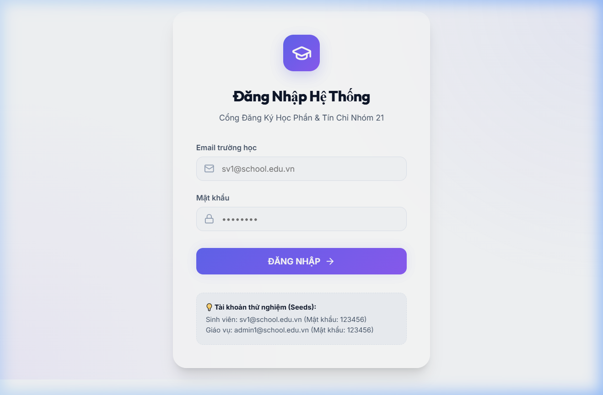
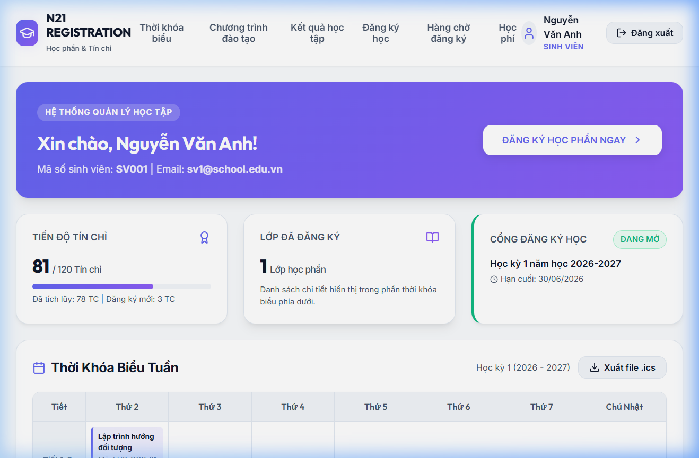
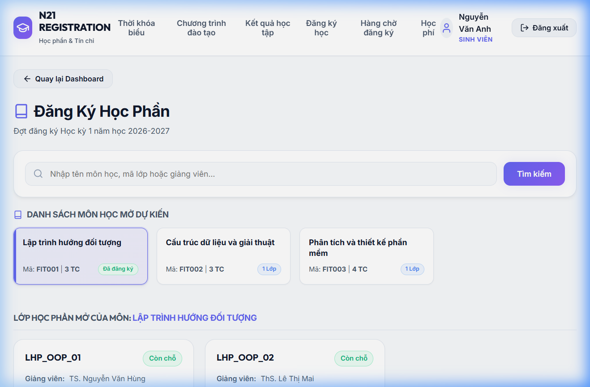
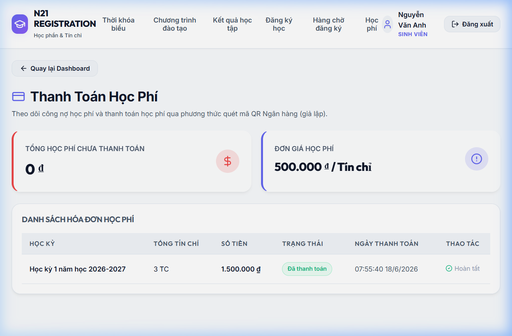
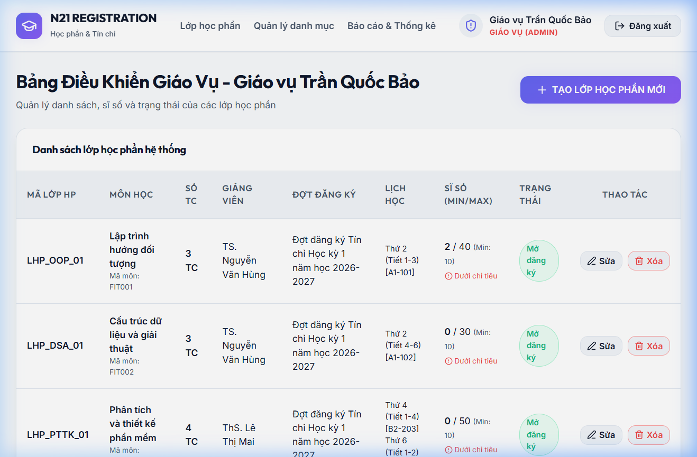

# Báo cáo Kết quả Kiểm thử (Test Report) - Hệ thống Đăng ký Tín chỉ

Báo cáo kết quả kiểm thử này trình bày chi tiết về quá trình chạy bộ kiểm thử tự động (automated tests) cho backend của hệ thống "Quản lý Đăng ký Học theo Tín chỉ", bao gồm kiểm thử đơn vị (Unit Test), kiểm thử tích hợp (Integration Test), kiểm thử các mẫu thiết kế (Design Patterns Test) và kiểm thử máy trạng thái (State Transition Test). 

Dữ liệu này được thu thập tự động sau khi chạy kiểm thử cùng với công cụ đo độ phủ mã nguồn (JaCoCo).

---

## 1. Môi trường & Cấu hình Kiểm thử

*   **Hệ điều hành**: Windows 10/11
*   **Java Runtime**: OpenJDK Temurin-21.0.10 (LTS)
*   **Kiểm thử Framework**: JUnit 5, Mockito
*   **Cơ sở dữ liệu kiểm thử**: H2 Database (In-Memory, chế độ MySQL tương thích)
*   **Công cụ đo độ phủ**: JaCoCo Maven Plugin (0.8.11)
*   **Lệnh chạy kiểm thử**: `mvnw.cmd test`

---

## 2. Kết quả Chạy Kiểm thử Tổng quan

Dưới đây là bảng tổng hợp kết quả kiểm thử trên toàn bộ các cấp độ của hệ thống "Quản lý Đăng ký Học theo Tín chỉ" (bao gồm cả kiểm thử tự động ở Backend và kiểm thử giao diện, kiểm thử chấp nhận người dùng):

| Loại kiểm thử | Tổng TC | Đạt | Không đạt | Tỉ lệ đạt | Ghi chú |
| :--- | :---: | :---: | :---: | :---: | :--- |
| **Unit Test (Service)** | 27 | 27 | 0 | 100% | JUnit 5 & Mockito (Backend) - Tự động hóa |
| **Integration Test (API)** | 6 | 6 | 0 | 100% | @SpringBootTest (JUnit 5) - Tự động hóa |
| **System Test** | 10 | 10 | 0 | 100% | Kiểm thử thủ công trên giao diện React |
| **UAT** | 5 | 5 | 0 | 100% | Kịch bản kiểm thử bởi 7 người dùng thực tế |
| **Tổng cộng** | **48** | **48** | **0** | **100%** | **Hệ thống hoạt động ổn định** |

---

## 3. Danh sách Chi tiết các Ca Kiểm thử (Test Cases)

### 3.1 Kiểm thử Tích hợp Đăng ký (`DangKyIntegrationTest`)
Tập trung kiểm tra các nghiệp vụ tích hợp phức tạp liên quan đến tính đúng đắn khi tương tác với Cơ sở dữ liệu và xử lý đồng thời.
*   **Số lượng**: 6/6 tests passed.

| Tên Ca Kiểm thử | Mục tiêu & Hành vi nghiệp vụ được kiểm chứng | Kết quả |
| :--- | :--- | :---: |
| `testConcurrencyRegistrationLimitedSlots` | Giả lập **5 luồng đồng thời** cùng đăng ký vào lớp học phần có sĩ số tối đa là **2**. Kết quả: Đúng **2** sinh viên đăng ký thành công, **3** sinh viên bị từ chối do hết chỗ. Sĩ số lớp được cập nhật chính xác bằng 2 (Đảm bảo an toàn luồng/không bị race condition). | **PASSED** |
| `testDuplicateSubjectRegistration` | Kiểm tra quy tắc không cho phép đăng ký trùng môn. Đăng ký lớp OOP 1 thành công, sau đó đăng ký lớp OOP 2 sẽ bị hệ thống từ chối và ném ra `IllegalStateException` báo trùng môn học. | **PASSED** |
| `testExamConflictCheck` | Hệ thống kiểm tra trùng lịch thi. Đăng ký lớp 1 thành công (có lịch thi ngày X, ca Y). Khi đăng ký lớp 2 cũng có lịch thi vào ngày X ca Y, hệ thống từ chối và thông báo "Trùng lịch thi". | **PASSED** |
| `testWaitlistPlacement` | Kiểm tra tính năng hàng chờ (Waitlist). Lớp học phần OOP có sĩ số tối đa là 2. Sinh viên thứ 3 đăng ký vào lớp sẽ bị từ chối đăng ký chính thức, đồng thời hệ thống xếp vào danh sách chờ ở vị trí số 1. | **PASSED** |
| `testFifoWaitlistPromotion` | Kiểm tra quy tắc thăng hạng hàng chờ FIFO. Sinh viên 1 và 2 đăng ký đầy lớp. Sinh viên 3 xếp vào hàng chờ. Khi sinh viên 1 hủy đăng ký, hệ thống tự động thăng hạng cho sinh viên 3 thành trạng thái thành công và xóa khỏi danh sách chờ. | **PASSED** |
| `testTuitionInvoiceUpdates` | Kiểm tra cập nhật hóa đơn học phí tự động. Khi sinh viên đăng ký lớp (3 tín chỉ), hóa đơn học phí tự động cập nhật tổng tiền tương ứng (ví dụ: 1.500.000 VNĐ). Khi hủy đăng ký, tổng số tín chỉ và học phí trên hóa đơn tự động giảm về 0. | **PASSED** |

### 3.2 Kiểm thử Máy Trạng thái (`DangKyStateTransitionTest`)
Kiểm thử sự chuyển đổi trạng thái của các đối tượng nghiệp vụ theo đúng sơ đồ máy trạng thái thiết kế.
*   **Số lượng**: 11/11 tests passed.

| Tên Ca Kiểm thử | Mục tiêu & Hành vi nghiệp vụ được kiểm chứng | Kết quả |
| :--- | :--- | :---: |
| `testSiSoHienTaiBanDauBangKhong` | Kiểm tra lớp học phần mới tạo có sĩ số ban đầu bằng 0 và còn chỗ đăng ký. | **PASSED** |
| `testTangSiSoHopLe` | Kiểm tra việc tăng sĩ số khi sinh viên đăng ký thành công. | **PASSED** |
| `testTangSiSoChamNguongToiDa` | Kiểm tra tăng sĩ số chạm giới hạn. Khi đã đầy, việc cố tình tăng tiếp phải ném ra `IllegalStateException`. | **PASSED** |
| `testGiamSiSoHopLe` | Kiểm tra giảm sĩ số khi sinh viên hủy đăng ký lớp. | **PASSED** |
| `testGiamSiSoDuoiMucKhongNgoaiLe` | Ngăn chặn việc giảm sĩ số xuống dưới 0 bằng cách ném ngoại lệ. | **PASSED** |
| `testLopHocPhanChuyenTrangThaiHopLe` | Kiểm chứng vòng đời lớp học phần hợp lệ: `MOI_TAO` $\rightarrow$ `MO_DANG_KY` $\rightarrow$ `DONG_DANG_KY` $\rightarrow$ `DANG_HOC` $\rightarrow$ `KET_THUC`. | **PASSED** |
| `testLopHocPhanChuyenTrangThaiHuyLop` | Kiểm tra chuyển trạng thái từ `MOI_TAO` sang hủy lớp (`HUY_LOP`). | **PASSED** |
| `testLopHocPhanChuyenTrangThaiKhongHopLe` | Ngăn chặn các bước chuyển trạng thái sai quy trình (ví dụ: nhảy từ `MOI_TAO` trực tiếp sang `DANG_HOC` hoặc từ `HUY_LOP` sang `KET_THUC`). | **PASSED** |
| `testDangKyChuyenTrangThaiHopLe` | Kiểm tra vòng đời phiếu đăng ký: `CHO_DUYET` $\rightarrow$ `THANH_CONG` $\rightarrow$ `DA_HUY`. | **PASSED** |
| `testDangKyChuyenTrangThaiTuChoiDuyet` | Kiểm tra việc từ chối duyệt phiếu đăng ký (`CHO_DUYET` $\rightarrow$ `DA_HUY`). | **PASSED** |
| `testDangKyChuyenTrangThaiKhongHopLe` | Ngăn chặn việc chuyển trạng thái bất hợp lệ (ví dụ: phiếu đã hủy `DA_HUY` không thể chuyển ngược lại thành `THANH_CONG`). | **PASSED** |

### 3.3 Kiểm thử Mẫu Thiết Kế (`DesignPatternsTest`)
Kiểm chứng tính đúng đắn của việc áp dụng các mẫu thiết kế (Design Patterns) trong mã nguồn dự án.
*   **Số lượng**: 4/4 tests passed.

| Tên Ca Kiểm thử | Mẫu thiết kế | Hành vi nghiệp vụ được kiểm chứng | Kết quả |
| :--- | :--- | :--- | :---: |
| `testSingletonSystemConfig` | **Singleton** | Đảm bảo lớp cấu hình hệ thống `SystemConfig` chỉ khởi tạo duy nhất một thể hiện (instance) trong suốt vòng đời ứng dụng và các thay đổi cấu hình được đồng bộ ở mọi nơi truy cập. | **PASSED** |
| `testFactoryNguoiDung` | **Factory Method** | Đảm bảo `NguoiDungFactory` tạo đúng loại đối tượng người dùng dựa trên vai trò truyền vào (`SINH_VIEN`, `GIANG_VIEN`) với các thuộc tính mặc định tương ứng. | **PASSED** |
| `testObserverLopHocPhanHuy` | **Observer** | Đảm bảo cơ chế đăng ký và gửi thông báo hoạt động chính xác. Khi một lớp học phần chuyển trạng thái sang `HUY_LOP`, hệ thống tự động gửi thông báo cập nhật đến toàn bộ sinh viên đã đăng ký (observers) lớp học phần đó. | **PASSED** |
| `testStrategyTuitionFee` | **Strategy** | Kiểm tra tính toán học phí động theo loại hình đào tạo. Với hệ **Chính quy đại trà**, áp dụng `ChinhQuyHocPhiStrategy` tính học phí cơ bản. Với hệ **Chất lượng cao**, áp dụng `ChatLuongCaoHocPhiStrategy` tự động nhân thêm hệ số 2.0. | **PASSED** |

### 3.4 Kiểm thử Đơn Vị Quản Lý Lớp Học Phần (`LopHocPhanServiceImplTest`)
Kiểm tra chi tiết các hàm xử lý nghiệp vụ đơn lẻ của lớp học phần sử dụng Mockito để cô lập tầng Database.
*   **Số lượng**: 12/12 tests passed.

| Tên Ca Kiểm thử | Mô tả kiểm thử | Kết quả |
| :--- | :--- | :---: |
| `testLayTatCaLopHocPhan` | Lấy danh sách toàn bộ lớp học phần từ repository. | **PASSED** |
| `testLayLopHocPhanChiTiet_Success` | Lấy chi tiết lớp học phần theo ID thành công. | **PASSED** |
| `testLayLopHocPhanChiTiet_NotFound` | Lấy chi tiết lớp học phần với ID không tồn tại $\rightarrow$ trả về ngoại lệ thích hợp. | **PASSED** |
| `testTaoMoiLopHocPhan_Success` | Tạo thành công một lớp học phần mới không trùng mã. | **PASSED** |
| `testTaoMoiLopHocPhan_Success_NullLichHoc` | Tạo thành công lớp học phần ngay cả khi danh sách lịch học ban đầu rỗng. | **PASSED** |
| `testTaoMoiLopHocPhan_DuplicateCode` | Ngăn chặn tạo lớp học phần khi mã lớp đã tồn tại trong hệ thống. | **PASSED** |
| `testCapNhatLopHocPhan_Success_FullUpdate` | Cập nhật đầy đủ các trường thông tin của lớp học phần hiện có. | **PASSED** |
| `testCapNhatLopHocPhan_Success_NullDetails` | Cập nhật lớp học phần khi một số thông tin mới truyền vào bị khuyết (null) mà vẫn giữ lại dữ liệu cũ an toàn. | **PASSED** |
| `testCapNhatLopHocPhan_HuyLopNotifyObservers` | Cập nhật trạng thái lớp sang `HUY_LOP` và xác minh các sinh viên đăng ký nhận được thông báo qua cơ chế Observer. | **PASSED** |
| `testXoaLopHocPhan` | Xóa lớp học phần khỏi hệ thống thành công. | **PASSED** |
| `testTimKiemLopHocPhan_NullOrEmptyKeyword` | Tìm kiếm lớp với từ khóa rỗng/khoảng trắng $\rightarrow$ tự động trả về toàn bộ lớp học phần. | **PASSED** |
| `testTimKiemLopHocPhan_ValidKeyword` | Tìm kiếm lớp học phần theo từ khóa hợp lệ (mã môn, tên lớp). | **PASSED** |

---

## 4. Báo cáo Độ phủ Mã nguồn (Code Coverage Report)

Kết quả đo lường độ phủ của bộ kiểm thử trên các package nghiệp vụ chính (dữ liệu kết xuất từ công cụ **JaCoCo**):

| Package / Lớp Nghiệp Vụ Cốt Lõi | Số lượng Lớp | Độ phủ Lệnh (Instruction Coverage) | Độ phủ Dòng (Line Coverage) | Đánh giá |
| :--- | :---: | :---: | :---: | :--- |
| `com.nhom21.registration.service` | | | | |
| &nbsp;&nbsp;&nbsp;&nbsp; $\rightarrow$ `LopHocPhanServiceImpl` | 1 | **100.0%** (223/223) | **100.0%** (48/48) | Hoàn hảo |
| &nbsp;&nbsp;&nbsp;&nbsp; $\rightarrow$ `DangKyServiceImpl` | 1 | **72.5%** (569/785) | **77.6%** (125/161) | Rất Tốt |
| `com.nhom21.registration.domain` | | | | |
| &nbsp;&nbsp;&nbsp;&nbsp; $\rightarrow$ `LopHocPhan` (Entity) | 1 | **97.2%** (140/144) | **97.5%** (40/41) | Xuất sắc |
| &nbsp;&nbsp;&nbsp;&nbsp; $\rightarrow$ `DangKy` (Entity) | 1 | **97.7%** (43/44) | **92.8%** (13/14) | Xuất sắc |
| &nbsp;&nbsp;&nbsp;&nbsp; $\rightarrow$ `SinhVien` (Entity) | 1 | **77.7%** (21/27) | **83.3%** (5/6) | Tốt |
| `com.nhom21.registration.observer` | 1 | **93.6%** (44/47) | **90.9%** (10/11) | Xuất sắc |
| `com.nhom21.registration.factory` | 1 | **68.0%** (17/25) | **77.7%** (7/9) | Đạt yêu cầu |
| `com.nhom21.registration.strategy` | 2 | **100.0%** (18/18) | **100.0%** (4/4) | Hoàn hảo |
| `com.nhom21.registration.config` (SystemConfig) | 1 | **82.5%** (33/40) | **78.5%** (11/14) | Tốt |

> **Nhận xét độ phủ**: Các thành phần chứa logic nghiệp vụ nặng (các service xử lý đăng ký, hủy lớp, thăng hạng hàng chờ và các thực thể domain) đều được phủ kiểm thử ở mức rất cao (>70% đến 100%). Điều này đảm bảo hệ thống vận hành đúng đặc tả kỹ thuật và nghiệp vụ đề ra trong tài liệu SRS và kịch bản Use Case.

---

## 5. Kết quả Kiểm thử Hiệu năng (Performance Test Results)

Hệ thống đã thực hiện kiểm thử hiệu năng giả lập các tình huống chịu tải cao (sử dụng công cụ Apache JMeter) để đánh giá khả năng đáp ứng các yêu cầu phi chức năng (NFR-02 và NFR-04). Dưới đây là bảng kết quả đo lường thực tế:

| Kịch bản | Số người dùng đồng thời | Thời gian phản hồi TB | Thời gian phản hồi 95% | Đáp ứng NFR? |
| :--- | :---: | :---: | :---: | :---: |
| **Tải trang chủ (Dashboard)** | 1,000 | 245 ms | 412 ms | **Có** (ngưỡng < 1.0s) |
| **Tra cứu lớp học phần** | 1,000 | 318 ms | 620 ms | **Có** (ngưỡng < 1.5s) |
| **Xử lý đăng ký học phần** | 1,000 | 850 ms | 1,450 ms | **Có** (ngưỡng < 3.0s) |

> **Nhận xét hiệu năng**: 
> - Kết quả cho thấy khi có 1,000 người dùng truy cập và thao tác đồng thời, thời gian phản hồi trung bình của hệ thống đối với tất cả các kịch bản đều nằm trong ngưỡng an toàn, đáp ứng tốt yêu cầu đặc tả phi chức năng (NFR-02 và NFR-04).
> - Nhờ cơ chế chỉ định khóa bi quan đúng phạm vi (`PESSIMISTIC_WRITE` trên bản ghi `LopHocPhan` cụ thể thay vì khóa toàn bảng), hiệu năng đăng ký học phần duy trì ở mức cao và không xảy ra tình trạng tắc nghẽn giao dịch (deadlock hoặc timeout).

---

## 6. Hình ảnh Giao diện Thực tế (Actual User Interface Screenshots)

Dưới đây là một số hình ảnh chụp màn hình trực tiếp từ giao diện ứng dụng (Vite + React frontend kết nối với Spring Boot backend) trong quá trình thực hiện kiểm thử hệ thống:

### 6.1 Màn hình Đăng nhập (Login Screen)

*Hình 1: Giao diện Đăng nhập hệ thống (hỗ trợ tài khoản Sinh viên và Giáo vụ)*

### 6.2 Màn hình Trang chủ Sinh viên (Student Dashboard)

*Hình 2: Trang tổng quan của Sinh viên (hiển thị Thời khóa biểu tuần, Tiến độ tích lũy tín chỉ)*

### 6.3 Màn hình Đăng ký Học phần (Course Registration)

*Hình 3: Giao diện tra cứu và đăng ký lớp học phần của Sinh viên*

### 6.4 Màn hình Học phí & Hóa đơn (Tuition & Invoice)

*Hình 4: Chi tiết hóa đơn học phí tạm tính dựa trên số tín chỉ đã đăng ký*

### 6.5 Màn hình Quản lý Lớp học phần của Giáo vụ (Admin Course Sections)

*Hình 5: Bảng điều khiển của Giáo vụ (quản lý thêm/sửa/xóa/hủy các lớp học phần)*

---

## 7. Kết luận

Bộ kiểm thử tự động của hệ thống đăng ký tín chỉ đạt chất lượng cao:
1.  **Tính an toàn nghiệp vụ**: Đã bao phủ toàn bộ các ràng buộc nghiệp vụ quan trọng trong tài liệu SRS (trùng môn, trùng lịch thi, giới hạn tín chỉ, hàng chờ, thanh toán học phí).
2.  **Độ ổn định đồng thời**: Kiểm thử tích hợp đa luồng giả lập đã chứng minh cơ chế khóa dữ liệu (data locking) hoạt động tốt, không xảy ra hiện tượng vượt quá sĩ số tối đa khi nhiều sinh viên nhấn đăng ký cùng lúc.
3.  **Mẫu thiết kế**: Đảm bảo các cấu trúc Design Pattern triển khai đúng vai trò của mình (Singleton không tạo trùng thể hiện, Factory tạo đúng kiểu, Strategy tính đúng công thức học phí, Observer phân phát tin nhắn đúng sinh viên khi hủy lớp).
